# Roteiros de Vídeos — NoPrumo (por menu e por cargo)

Documento de produção para gravar **um vídeo por menu**, separado por cargo, com narração pronta para gerar no **ElevenLabs**. Cada roteiro traz: objetivo, duração sugerida, o passo a passo do que capturar na tela e o texto de narração completo.

## Orientações gerais de produção

- **Voz (ElevenLabs):** voz masculina adulta em português do Brasil, tom acolhedor e institucional, ritmo calmo (velocidade ~0,95). Público de faixa etária variada — pausas claras entre frases.
- **Pronúncias:** "gov.br" = "góv ponto bê érre"; "NoPrumo" = "No-Prumo" (junto); "CIM" = "cim" (uma sílaba); "Ir∴" ler como "Irmão"; "QR Code" = "quê-érre côde"; "Pix", "Asaas", "Drive" e "Gmail" como se falam usualmente.
- **Captura:** gravar em `https://teste.noprumo.ia.br` (staging) com a **Loja de Testes nº 7777** (senha `teste123`: `teste-01` VM, `teste-02` Secretário, `teste-03` Tesoureiro, `teste-04` Esmoler, `teste-05` Conselho) ou a **demo 9999** (contas demo-vm, demo-sec, demo-tes…). Resolução 1920×1080, cursor visível, sem dados reais.
- **Estrutura padrão de cada vídeo:** 3 s de tela do menu parado → ação narrada → encerramento no resultado final. Sem música alta por cima da narração.
- **Nomenclatura dos arquivos:** `cargo-menu.mp4` (ex.: `obreiro-carteirinha.mp4`, `secretario-atas.mp4`).

---

# PARTE 1 — OBREIRO (todo irmão do quadro)

O Obreiro comum vê: Dashboard, Notificações, Carteirinha Digital, Biblioteca Digital, Membros, Sessões e Presenças, Atas, Candidatos, Atestado de Regularidade, Meu perfil, Privacidade (LGPD), Alterar senha e Tour.

## 1.1 — Login e primeiro acesso (`obreiro-login.mp4`)

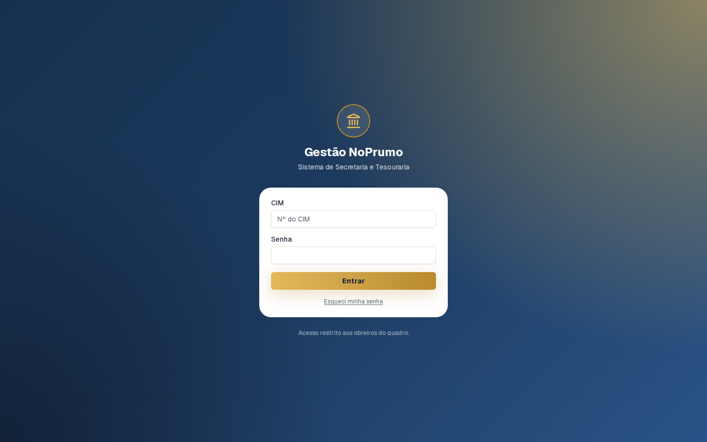

- **Objetivo:** mostrar como entrar no sistema.
- **Duração:** ~45 s.
- **Na tela:** abrir noprumo.ia.br → digitar CIM e senha → botão Entrar → se for filiado a mais de uma Loja, aparece a escolha da Loja → dashboard. Mostrar também o link "Esqueci minha senha" (código por e-mail).
- **Narração:**

> Bem-vindo ao NoPrumo, o sistema de gestão da sua Loja. Para entrar, acesse o endereço da plataforma e informe o seu CIM — o número do seu Cadastro de Identificação Maçônica — e a sua senha. No primeiro acesso, a senha provisória é o seu CPF, e o sistema pedirá que você crie uma senha nova e pessoal. Se você é filiado a mais de uma Loja, o sistema pergunta em qual delas deseja entrar. E se esquecer a senha, use o botão "Esqueci minha senha": você recebe um código de confirmação no seu e-mail e cadastra uma senha nova na hora. Simples, rápido e seguro.

## 1.2 — Dashboard do Obreiro (`obreiro-dashboard.mp4`)

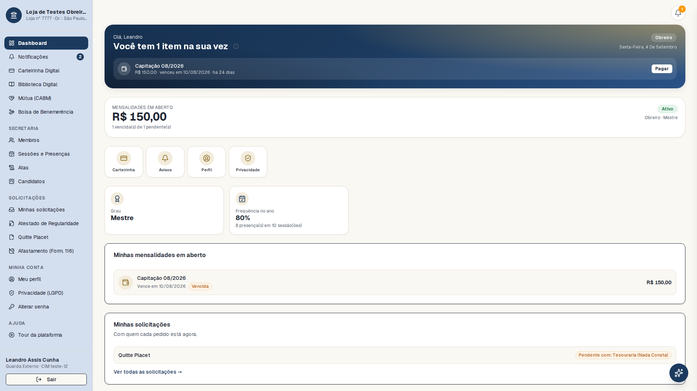

- **Objetivo:** visão geral pessoal do irmão.
- **Duração:** ~60 s.
- **Na tela:** dashboard após login: saudação, situação (ativo/regular), grau, frequência anual, próximas sessões, mensalidades em aberto com link de pagamento, aniversários.
- **Narração:**

> Este é o seu painel de entrada. Aqui você vê, de relance, tudo o que importa na sua vida maçônica: a sua situação na Loja, o seu grau, a sua frequência nas sessões do ano e as próximas sessões agendadas. Se houver alguma mensalidade em aberto, ela aparece aqui, com o botão para pagar por cartão, boleto ou Pix, sem precisar procurar ninguém. O painel também lembra os aniversários dos irmãos e dos familiares, para que ninguém passe em branco. Cada cartão é clicável e leva você direto à tarefa. É o seu ponto de partida todos os dias.

## 1.3 — Notificações (`obreiro-notificacoes.mp4`)

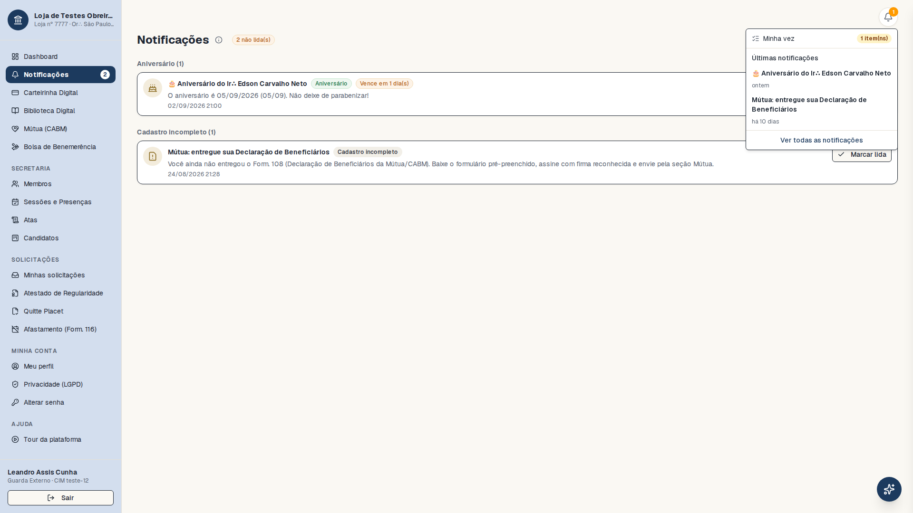

- **Objetivo:** central de avisos.
- **Duração:** ~40 s.
- **Na tela:** sino com contador na barra lateral → página de Notificações → aviso dirigido ao irmão (ex.: frequência baixa) e aniversários → marcar como lida.
- **Narração:**

> O sino de notificações é a central de avisos do sistema. Para você, Obreiro, chegam aqui os avisos que dizem respeito à sua caminhada — por exemplo, um alerta se a sua frequência estiver abaixo do mínimo da Loja, além dos aniversários dos irmãos e familiares. O número vermelho mostra quantos avisos ainda não foram lidos. E o melhor: quando a pendência é resolvida, o aviso desaparece sozinho. Nada de bagunça — só o que precisa da sua atenção.

## 1.4 — Carteirinha Digital (`obreiro-carteirinha.mp4`)

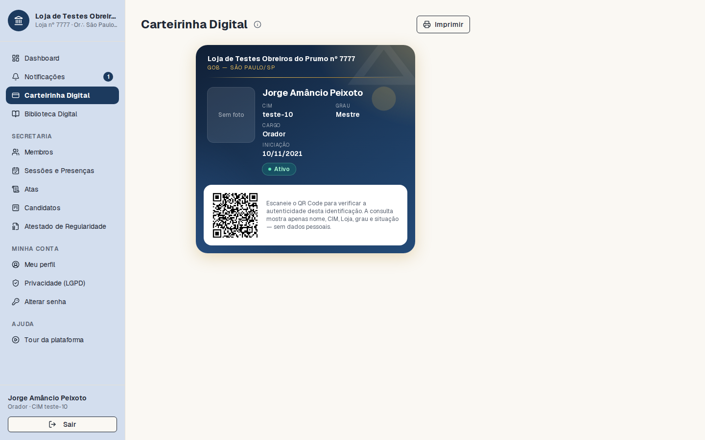

- **Objetivo:** identificação digital com QR Code.
- **Duração:** ~45 s.
- **Na tela:** menu Carteirinha Digital → carteirinha com foto, nome, CIM, grau e QR Code → simular leitura do QR (página pública de verificação) → botão de imprimir.
- **Narração:**

> A sua Carteirinha Digital é a sua identificação maçônica no celular. Ela traz a sua foto, o seu nome, o CIM, o grau e um QR Code de verificação. Ao visitar outra Loja, basta apresentar a tela: quem escanear o código vê, na hora, a confirmação de que você é membro regular do quadro. Se preferir o papel, use o botão de imprimir e leve a versão física. Sua identidade maçônica, sempre à mão.

## 1.5 — Biblioteca Digital (`obreiro-biblioteca.mp4`)

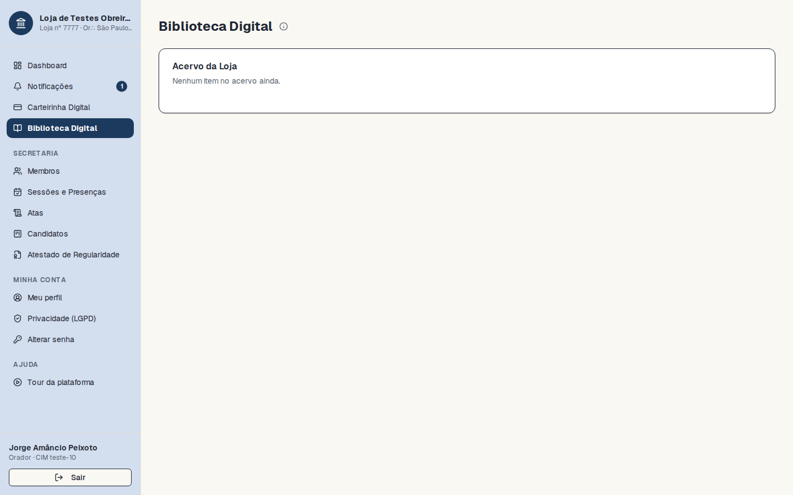

- **Objetivo:** acervo de estudos.
- **Duração:** ~35 s.
- **Na tela:** menu Biblioteca → categorias/lista de itens → abrir um item → download.
- **Narração:**

> A Biblioteca Digital é o acervo da Loja ao alcance de todos os irmãos: livros, rituais, decretos e regulamentos, organizados para consulta e download a qualquer hora. A Secretaria mantém o acervo atualizado — e você estuda no seu ritmo, do computador ou do celular.

## 1.6 — Sessões, presença por QR Code e Livro de Presenças (`obreiro-sessoes.mp4`)

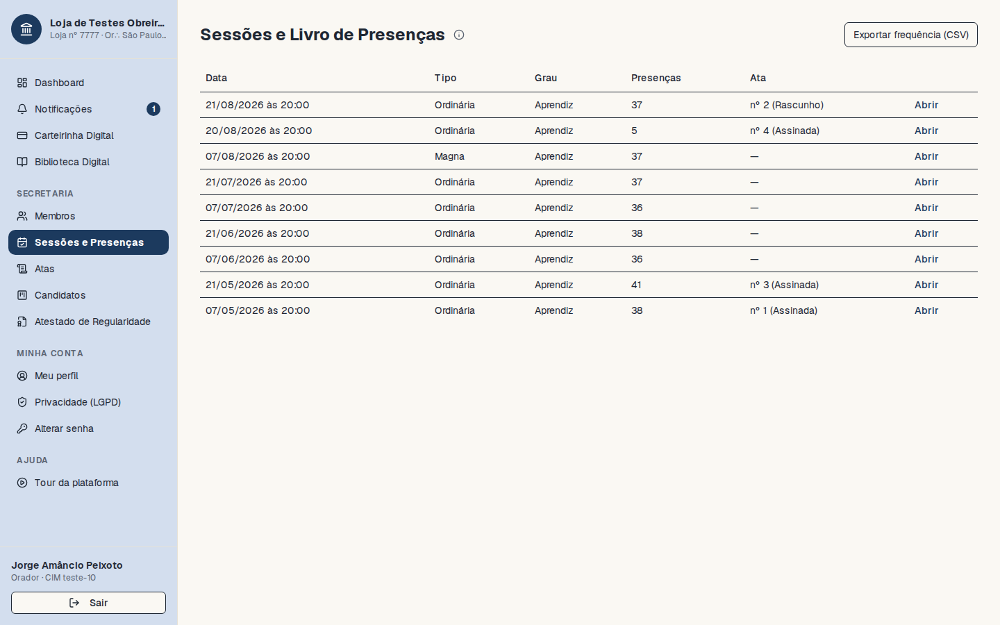

- **Objetivo:** agenda e check-in.
- **Duração:** ~60 s.
- **Na tela:** menu Sessões e Presenças → lista de sessões → QR Code de check-in exibido na sessão → celular escaneando e confirmando presença → Livro de Presenças com a frequência anual.
- **Narração:**

> Em Sessões e Presenças você acompanha a agenda da Loja: data, tipo de sessão e grau. No dia da sessão, a presença é registrada de um jeito moderno: um QR Code é exibido na entrada, você aponta a câmera do celular, confirma — e pronto, presença lançada. Visitantes de outras Lojas também fazem o check-in pelo mesmo código, e recebem um certificado de visita. Tudo alimenta o Livro de Presenças, que mostra a frequência anual de cada irmão — um dado importante, porque a frequência mínima é requisito para a progressão de grau.

## 1.7 — Atas (visão do Obreiro) (`obreiro-atas.mp4`)

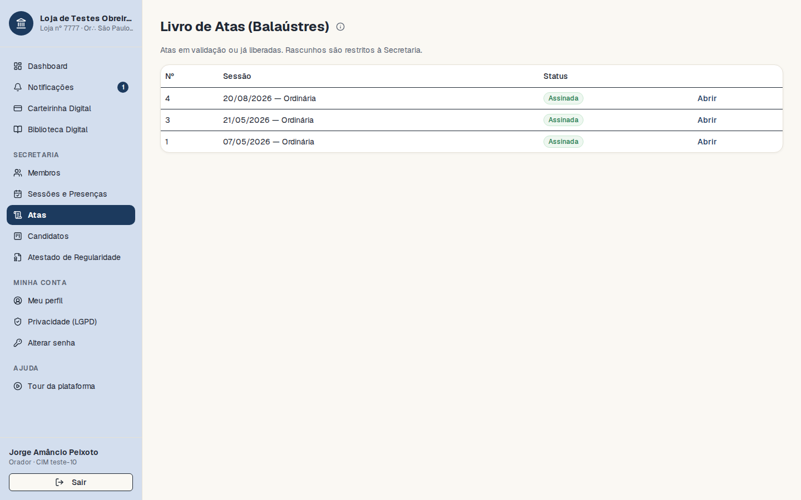

- **Objetivo:** validação da minuta por e-mail e consulta.
- **Duração:** ~40 s.
- **Na tela:** menu Atas → lista com status → abrir uma ata assinada → mostrar (mock) o e-mail de validação da minuta.
- **Narração:**

> As atas da Loja ficam disponíveis para consulta no menu Atas. Antes de uma ata ser assinada, a minuta é enviada por e-mail a todos os irmãos para validação — você lê e, se for o caso, sugere ajustes, tudo antes da assinatura. Depois de assinada pelo Venerável e pelo Secretário, a versão final fica selada e arquivada. Transparência do início ao fim.

## 1.8 — Candidatos: apadrinhar (`obreiro-candidatos.mp4`)

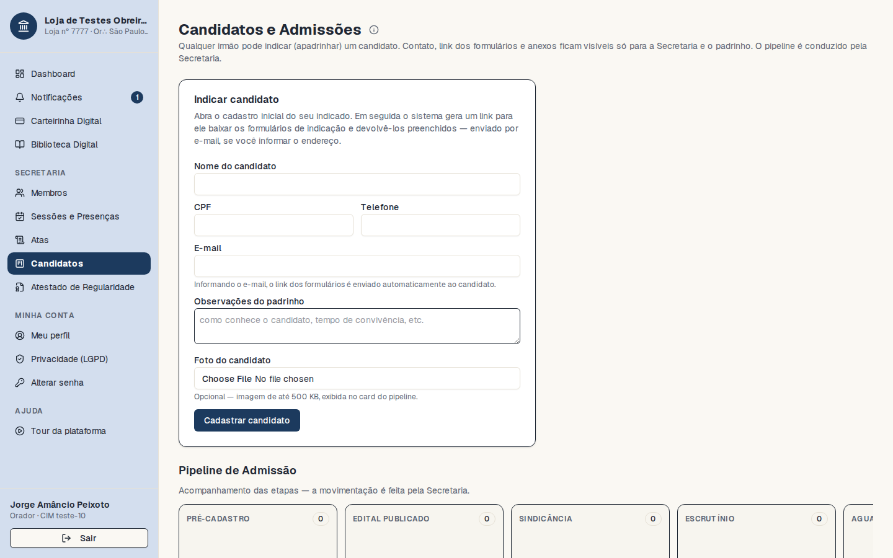

- **Objetivo:** qualquer irmão pode indicar um candidato.
- **Duração:** ~50 s.
- **Na tela:** menu Candidatos → botão de novo candidato → cadastro inicial → link pessoal gerado → (aba anônima) página do candidato com formulários pré-preenchidos.
- **Narração:**

> Conhece alguém pronto para bater às portas do Templo? Qualquer irmão pode apadrinhar um candidato. No menu Candidatos, faça o cadastro inicial com os dados básicos. O sistema gera um link pessoal e exclusivo: você envia ao candidato, e ele mesmo baixa os formulários de indicação — já preenchidos com os dados da Loja — e os devolve preenchidos pela própria página. A partir daí, a Secretaria conduz as etapas seguintes: edital, sindicância, escrutínio e o Placet da Potência. Apadrinhar nunca foi tão organizado.

## 1.9 — Atestado de Regularidade (`obreiro-atestado.mp4`)

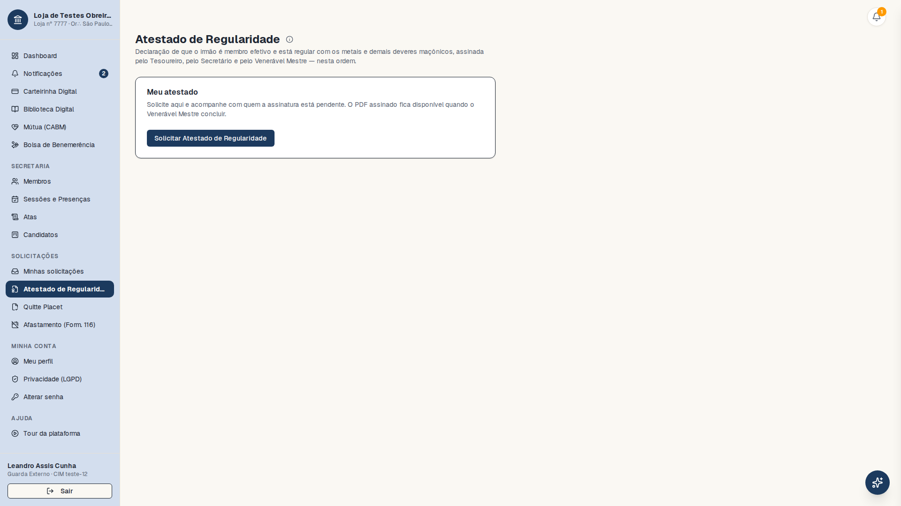

- **Objetivo:** solicitar o atestado e acompanhar as três assinaturas.
- **Duração:** ~60 s.
- **Na tela:** menu Atestado de Regularidade → botão "Solicitar Atestado de Regularidade" → status aguardando assinaturas (Tesoureiro → Secretário → Venerável Mestre) → atestado concluído → botão Baixar PDF.
- **Narração:**

> Precisa comprovar que está regular com a Loja? O Atestado de Regularidade declara que você é membro efetivo e está em dia com os metais e demais deveres maçônicos. Qualquer irmão ativo pode solicitar: um clique, e o pedido segue automaticamente para as três assinaturas — primeiro o Tesoureiro, que confirma a regularidade financeira; depois o Secretário; e, por fim, o Venerável Mestre. Cada um pode assinar com a senha do sistema ou com a assinatura digital do gov.br. Você acompanha o andamento pela própria tela e, quando concluído, baixa o PDF assinado na hora.

## 1.10 — Meu perfil, Privacidade e senha (`obreiro-conta.mp4`)

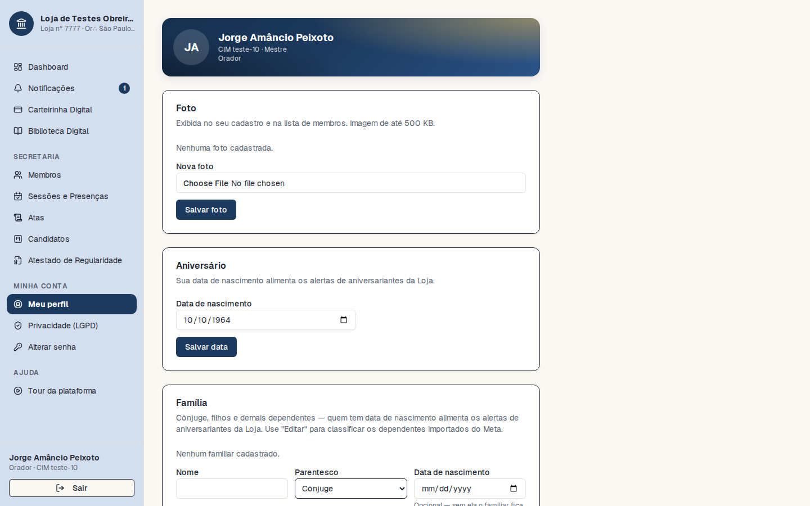

- **Objetivo:** dados pessoais, foto, LGPD.
- **Duração:** ~45 s.
- **Na tela:** Meu perfil (foto, contato) → Privacidade LGPD (baixar meus dados, solicitar exclusão) → Alterar senha.
- **Narração:**

> Em Minha Conta, você cuida dos seus dados. No Meu Perfil, atualize a foto — que aparece na carteirinha — e as informações de contato. Na área de Privacidade, o sistema cumpre a Lei Geral de Proteção de Dados: você pode baixar uma cópia de tudo o que a Loja guarda sobre você e, se um dia deixar o quadro, solicitar a exclusão dos seus dados. E em Alterar Senha, mantenha o seu acesso sempre seguro. Seus dados, sob o seu controle.

---

# PARTE 2 — SECRETÁRIO

O Secretário vê tudo do Obreiro e mais: Cargos do Rito, Pranchas, E-mails da Loja, Documentos (Drive), Progressões, Visitas a Oficinas, Quitte Placets, Configurações da Loja e Auditoria.

## 2.1 — Dashboard do Secretário (`secretario-dashboard.mp4`)

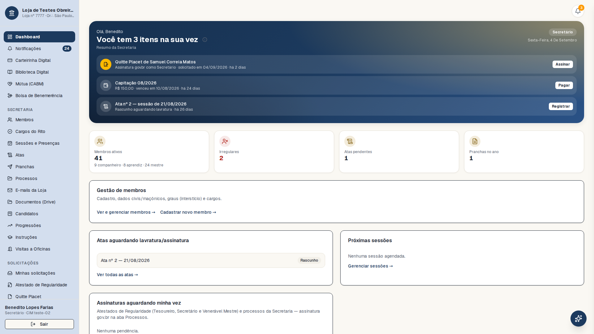

- **Duração:** ~50 s.
- **Na tela:** cartões: membros ativos por grau, irregulares, atas pendentes, pranchas no ano → card de atas aguardando lavratura/assinatura → card "Atestados aguardando minha assinatura" → próximas sessões.
- **Narração:**

> O painel do Secretário é a mesa de trabalho da Loja. Nos cartões do topo: o total de membros ativos, com o resumo por grau; os irmãos em situação irregular; as atas pendentes; e as pranchas expedidas no ano. Logo abaixo, as atas que aguardam lavratura ou assinatura, os atestados de regularidade na sua vez de assinar e as próximas sessões agendadas. Um olhar, e você já sabe por onde começar o dia.

## 2.2 — Membros: o quadro de Obreiros (`secretario-membros.mp4`)

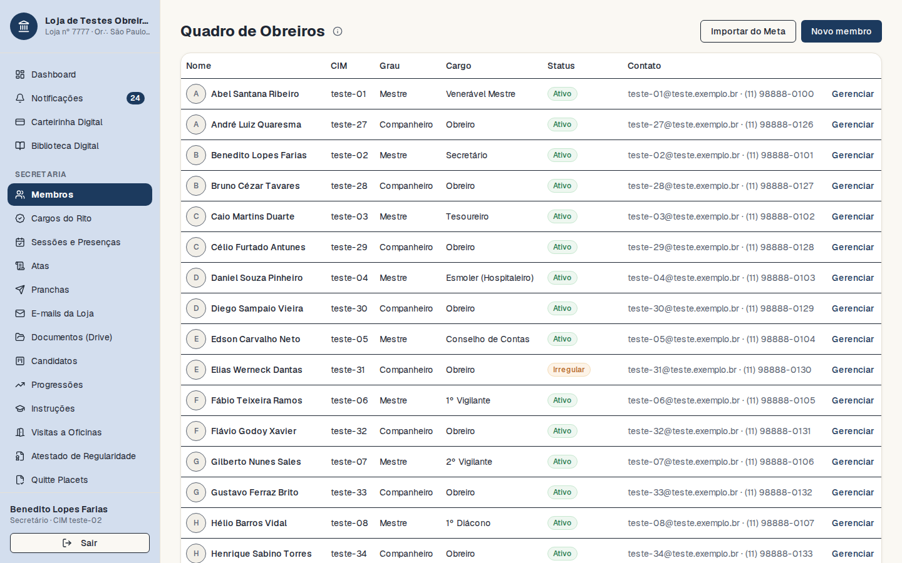

- **Duração:** ~75 s.
- **Na tela:** lista com busca e filtros → ficha de um membro (dados civis e maçônicos, foto, assinatura) → registrar grau → nomear cargo do rito → nível de acesso → familiares → histórico.
- **Narração:**

> O menu Membros é o quadro de Obreiros completo. Cada irmão tem sua ficha, com dados civis e maçônicos: contato, grau, cargo, situação — ativo, irregular ou licenciado — foto e assinatura digitalizada. Pela ficha, você registra a progressão de grau, nomeia para cargos do rito e cadastra os familiares, cujos aniversários passam a ser lembrados pelo sistema. Atenção a um detalhe importante: o cargo ritualístico e o nível de acesso ao sistema são coisas separadas. O cargo aparece nas atas e no histórico; o nível de acesso define o que o irmão pode fazer dentro do sistema. E se algum cadastro estiver incompleto, o sistema avisa — porque dados completos são a base das plataformas oficiais.

## 2.3 — Cargos do Rito (`secretario-cargos.mp4`)

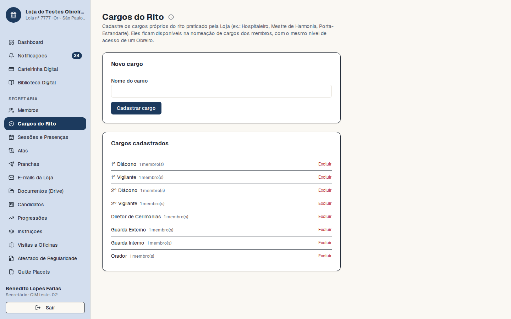

- **Duração:** ~30 s.
- **Na tela:** lista de cargos → adicionar um cargo novo (ex.: Mestre de Harmonia) → cargo em uso não pode ser excluído.
- **Narração:**

> Cada rito tem seus cargos — e cada Loja, suas particularidades. No menu Cargos do Rito, cadastre os cargos conforme a tradição da sua Oficina: Vigilantes, Orador, Mestre de Harmonia, o que a sua Loja precisar. Eles ficam disponíveis na nomeação dos membros, entram no histórico e aparecem nas atas. Um cargo em uso fica protegido: não pode ser excluído por engano.

## 2.4 — Sessões: criar, convite e presenças (`secretario-sessoes.mp4`)

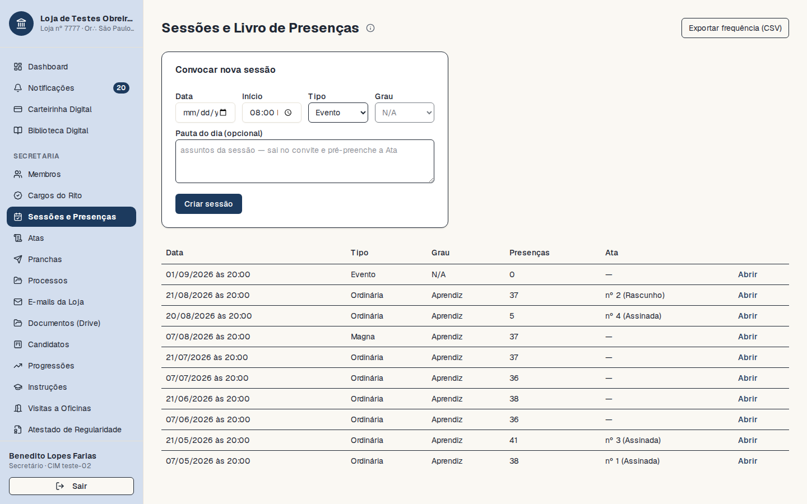

- **Duração:** ~75 s.
- **Na tela:** criar sessão (tipo, grau, data) → convite com a arte da Loja gerado e enviado (WhatsApp) → QR de check-in → lançar presenças → Livro de Presenças → botão "Lavrar ata".
- **Narração:**

> A vida da Loja gira em torno das sessões — e aqui está todo o ciclo. Crie a sessão informando tipo, grau e data. O sistema gera o convite com a arte da própria Loja, pronto para enviar aos irmãos pelo WhatsApp. No dia, o QR Code de check-in registra a presença de membros e de visitantes — que recebem certificado de visita. Depois, o Livro de Presenças consolida a frequência anual de cada irmão, com alertas de quem está abaixo do mínimo. E, encerrada a sessão, um clique em "Lavrar ata" já abre o rascunho no modelo da Loja. Da convocação à ata, sem papel perdido.

## 2.5 — Atas: do rascunho à assinatura (`secretario-atas.mp4`)

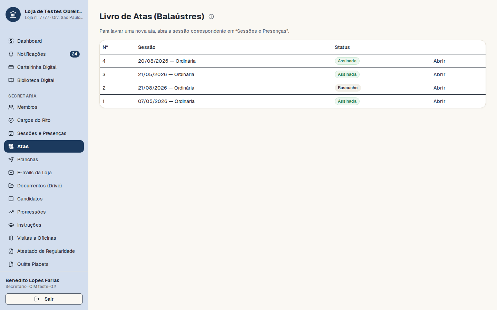

- **Duração:** ~90 s.
- **Na tela:** rascunho gerado do modelo → editar → enviar minuta por e-mail aos irmãos → aplicar ajustes → liberar para assinaturas → VM assina primeiro, Secretário depois (senha) → alternativa gov.br: baixar PDF, assinar no portal assinador.iti.br, subir o arquivo → ata selada no quadro e no Drive.
- **Narração:**

> A ata é o coração documental da Loja — e o NoPrumo cuida do fluxo completo. O rascunho nasce do modelo da própria Loja, com cabeçalho institucional e os dados da sessão já preenchidos. Você edita o texto e envia a minuta por e-mail a todos os irmãos, que validam e sugerem ajustes. Aprovada a minuta, a ata segue para as assinaturas, sempre na ordem: primeiro o Venerável Mestre, depois o Secretário. Há dois caminhos: a assinatura no próprio sistema, confirmada por senha e com a imagem da assinatura aplicada ao PDF; ou a assinatura digital do gov.br — baixa-se o PDF, assina-se no portal oficial, e o arquivo assinado volta ao sistema, que confere o selo digital. Com as duas assinaturas, a ata é selada: vai ao quadro, fica disponível aos irmãos e é arquivada automaticamente no Google Drive da Loja. Segurança jurídica e memória preservada.

## 2.6 — Pranchas e formulários do GOB-SP (`secretario-pranchas.mp4`)

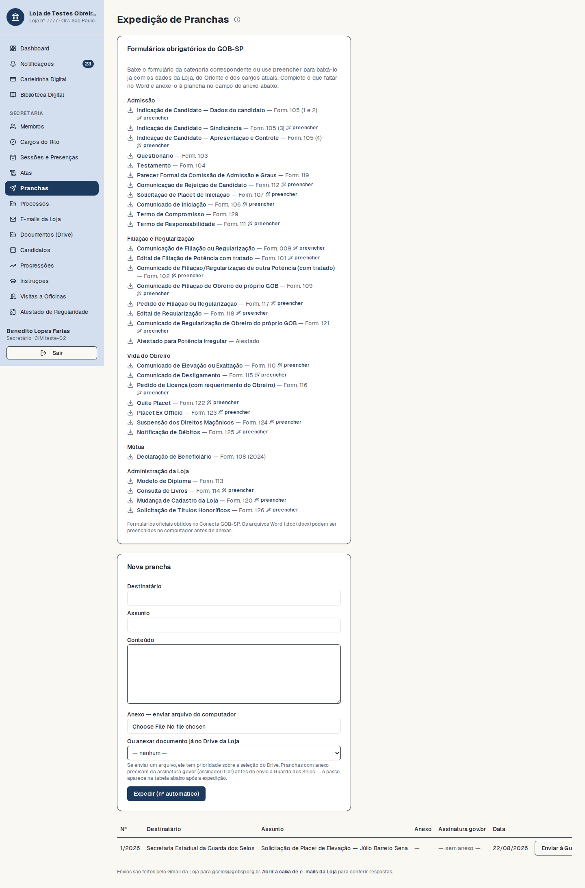

- **Duração:** ~75 s.
- **Na tela:** catálogo de formulários oficiais por categoria → baixar formulário já preenchido → criar prancha → anexar → assinar anexo no gov.br (portal) → subir PDF assinado → expedir à Guarda dos Selos pelo Gmail da Loja → registro da expedição.
- **Narração:**

> Prancha é o ofício formal da Loja — a carta oficial que segue à Potência. O sistema traz o catálogo com os formulários oficiais do GOB-SP, organizados por categoria: admissão, filiação e regularização, vida do Obreiro, mútua e administração. Melhor ainda: os formulários já saem preenchidos com os dados da Loja e do irmão. O fluxo é direto: baixe o formulário, confira, anexe à prancha e assine o anexo com a assinatura digital do gov.br. Com o PDF assinado no sistema, a prancha é expedida à Guarda dos Selos pelo próprio Gmail da Loja, com registro de envio. Ofício expedido, protocolo guardado.

## 2.7 — E-mails da Loja (`secretario-emails.mp4`)

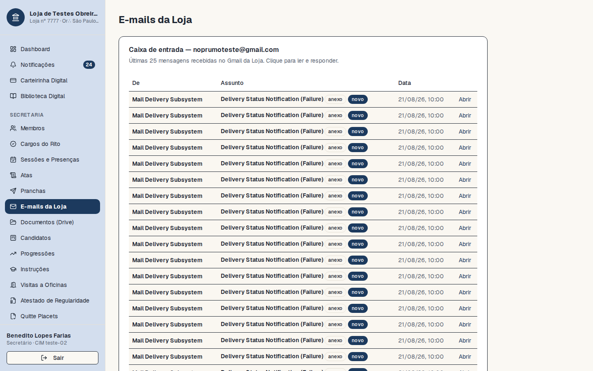

- **Duração:** ~40 s.
- **Na tela:** caixa de entrada do Gmail da Loja dentro do sistema → abrir resposta da Guarda dos Selos → baixar anexo → responder na conversa.
- **Narração:**

> As respostas da Guarda dos Selos e as mensagens de outras Lojas chegam ao Gmail da Loja — e você as lê sem sair do sistema. O menu E-mails da Loja mostra a caixa de entrada, permite baixar anexos e responder na mesma conversa. A correspondência oficial da Oficina, centralizada e à vista de quem gere.

## 2.8 — Documentos (Drive) (`secretario-documentos.mp4`)

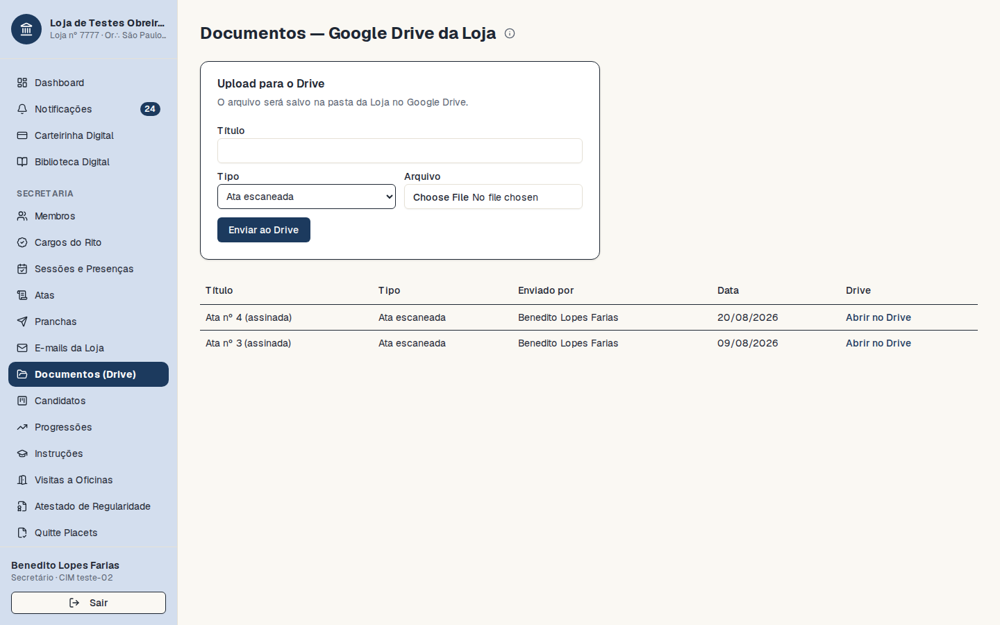

- **Duração:** ~35 s.
- **Na tela:** arquivo digital no Drive → pastas → enviar documento → abrir ata assinada arquivada.
- **Narração:**

> O menu Documentos é o arquivo digital da Loja, guardado no Google Drive conectado à Oficina. Atas assinadas chegam aqui automaticamente; regulamentos, decretos e documentos históricos você envia quando quiser. Tudo organizado, tudo preservado — a memória da Loja em segurança, fora de gavetas e arquivos mortos.

## 2.9 — Candidatos: o processo de admissão completo (`secretario-admissoes.mp4`)

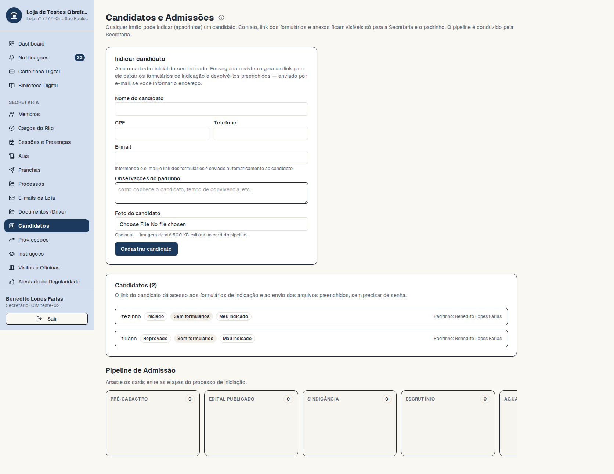

- **Duração:** ~80 s.
- **Na tela:** quadro Kanban do processo → candidato com formulários devolvidos → edital → comissão de sindicância → escrutínio (votação) → Placet → iniciação.
- **Narração:**

> Depois que um irmão apadrinha um candidato, a condução do processo é da Secretaria — e o sistema organiza tudo em um quadro de etapas. Com os formulários de indicação devolvidos, publica-se o edital. Em seguida, a sindicância: a comissão é designada e registra seus pareceres. Vem então o escrutínio — a votação secreta da Loja — e, aprovado, o pedido do Placet, a autorização final da Potência. Cada etapa tem seus registros e suas travas: nada avança fora da ordem. Do primeiro contato à iniciação, o processo inteiro documentado.

## 2.10 — Progressões de grau (`secretario-progressoes.mp4`)

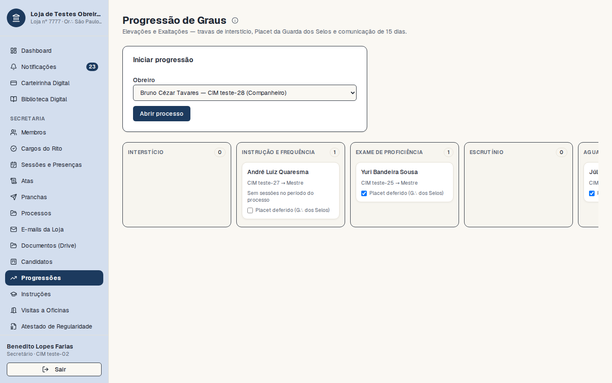

- **Duração:** ~75 s.
- **Na tela:** Kanban de progressões → interstício cumprido (alerta) → instrução e frequência (travas) → exame de proficiência → escrutínio → Placet → cerimônia → comunicação de 15 dias.
- **Narração:**

> A caminhada do irmão ao próximo grau — a Elevação a Companheiro, a Exaltação a Mestre — segue requisitos que o sistema confere automaticamente. O interstício: o tempo mínimo no grau, com aviso quando é cumprido. As instruções ministradas pelos Vigilantes e a frequência mínima nas sessões — travas que precisam estar verdes para o processo andar. Depois, o exame de proficiência, o escrutínio e o Placet da Potência. Realizada a cerimônia, o sistema ainda lembra do prazo regulamentar de quinze dias para comunicar o portal da Potência, com matéria e fotos. Nenhum requisito esquecido, nenhum prazo perdido.

## 2.11 — Visitas a Oficinas (`secretario-visitas.mp4`)

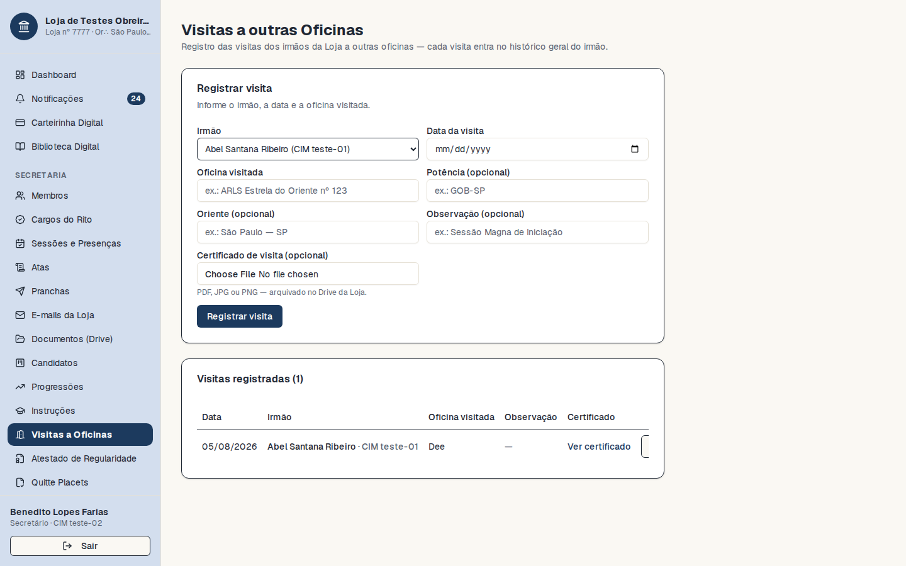

- **Duração:** ~30 s.
- **Na tela:** registro de visitas de irmãos da Loja a outras Oficinas → lista e certificados.
- **Narração:**

> Quando um irmão da Loja visita outra Oficina, a visita é registrada aqui — data, Loja visitada e certificado. É a contrapartida do check-in de visitantes: a vida maçônica do quadro, dentro e fora do Templo, documentada.

## 2.12 — Atestado de Regularidade (assinatura do Secretário) (`secretario-atestado.mp4`)

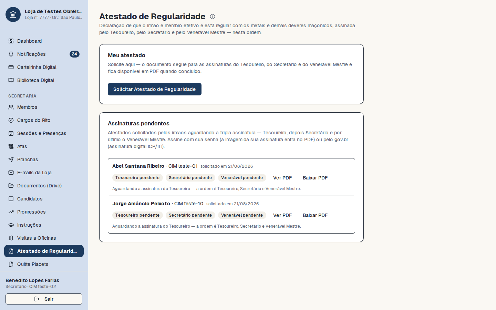

- **Duração:** ~50 s.
- **Na tela:** notificação "aguarda assinatura do Secretário" → página de atestados → pendentes → assinar com senha OU fluxo gov.br (baixar PDF com a assinatura do Tesoureiro, assinar no portal, subir) → segue ao VM.
- **Narração:**

> Quando um irmão solicita o Atestado de Regularidade, a ordem das assinaturas é: Tesoureiro, Secretário e Venerável Mestre. Assim que o Tesoureiro assina, chega a sua vez — e o sistema avisa: a pendência aparece no seu painel e na central de notificações. Na página de atestados, você assina com a sua senha, aplicando a imagem da sua assinatura ao documento, ou pelo gov.br: baixa o PDF já com a assinatura do Tesoureiro, assina no portal oficial e sobe o arquivo. Feito isso, o atestado segue ao Venerável Mestre para a assinatura final.

## 2.13 — Quitte Placets (`secretario-quitte.mp4`)

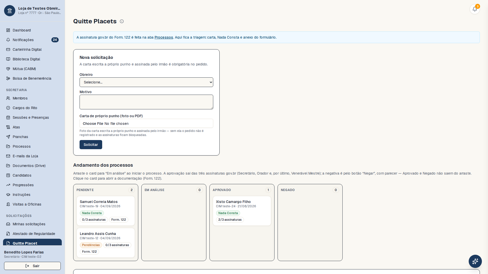

- **Duração:** ~60 s.
- **Na tela:** quadro de etapas → trava do Nada Consta da Tesouraria → dupla assinatura VM + Secretário → Form. 122 preenchido → anexar assinado → envio à Guarda dos Selos.
- **Narração:**

> O Quitte Placet é o documento de desligamento ou transferência de um irmão — e exige rigor. O sistema impõe duas travas de governança: primeiro, o Nada Consta da Tesouraria — sem a quitação financeira confirmada, a emissão fica bloqueada; depois, a dupla assinatura do Venerável Mestre e do Secretário. O formulário oficial, o Form. 122, sai já preenchido; assinado, é anexado e expedido à Guarda dos Selos pelo e-mail da Loja. Acompanhe cada etapa pelo quadro — o desligamento conduzido com a seriedade que merece.

## 2.14 — Configurações da Loja e Auditoria (`secretario-config.mp4`)

- **Duração:** ~60 s.
- **Na tela:** dados cadastrais, logo, cabeçalho das atas, frequência mínima, limite de inadimplência, integrações (Asaas, Drive/Gmail), template do convite → tela de Auditoria com o registro de ações.
- **Narração:**

> Nas Configurações da Loja ficam os parâmetros que moldam o sistema à sua Oficina: dados cadastrais, logotipo, o cabeçalho institucional que sai nas atas, a frequência mínima exigida para progressão, o limite de mensalidades vencidas antes de o irmão ficar irregular, e as integrações — o gateway de pagamentos, o Google Drive e o Gmail da Loja, e até o modelo do convite de sessão. E, para a transparência da gestão, a tela de Auditoria registra quem fez o quê e quando, em todas as ações sensíveis do sistema. Governança de ponta a ponta.

---

# PARTE 3 — TESOUREIRO

O Tesoureiro vê os menus comuns e mais: Mensalidades, Despesas e Balancete.

## 3.1 — Dashboard do Tesoureiro (`tesoureiro-dashboard.mp4`)

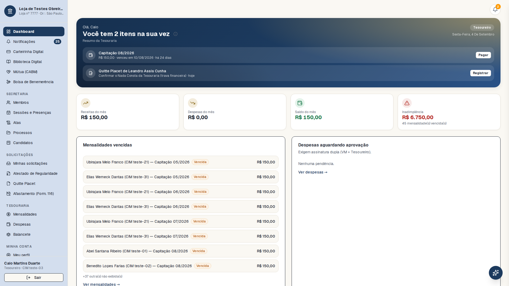

- **Duração:** ~50 s.
- **Na tela:** receitas, despesas e saldo do mês → inadimplência → mensalidades vencidas → despesas aguardando aprovação → card "Atestados aguardando minha assinatura".
- **Narração:**

> O painel do Tesoureiro mostra a saúde financeira da Loja em números claros: receitas, despesas e saldo do mês, e o total da inadimplência, com a lista das mensalidades vencidas. Logo abaixo, as despesas que aguardam aprovação e — novidade — os Atestados de Regularidade que aguardam a sua assinatura: como guardião das finanças, o Tesoureiro é o primeiro a assinar, confirmando que o irmão está em dia com os metais. Tudo o que depende de você, em uma só tela.

## 3.2 — Mensalidades (capitações) (`tesoureiro-mensalidades.mp4`)

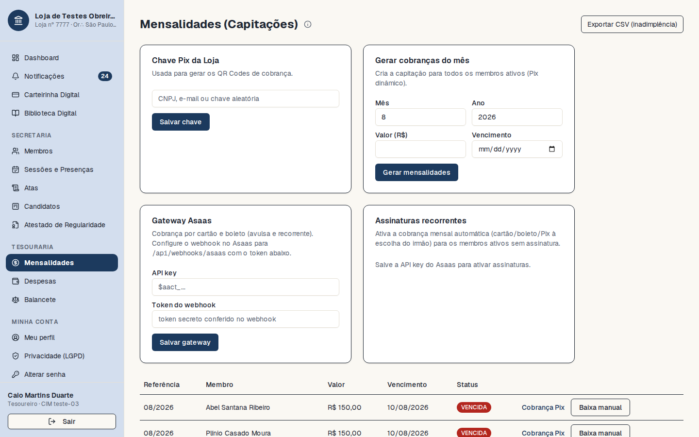

- **Duração:** ~75 s.
- **Na tela:** gerar cobranças do mês → link de pagamento (cartão, boleto, Pix via Asaas) → baixa manual → status vencidas → irmão irregular automático ao passar o limite.
- **Narração:**

> As capitações — as mensalidades dos irmãos — ganham aqui um fluxo profissional. Com um clique, você gera as cobranças do mês para todo o quadro. Cada irmão recebe o link de pagamento e escolhe como pagar: cartão, boleto ou Pix, pela integração com o gateway de pagamentos. Pagou por fora? Dê a baixa manual. O sistema acompanha os vencimentos e aplica a regra da Loja automaticamente: ao acumular mensalidades vencidas além do limite configurado, o irmão passa à situação irregular — e volta ao normal quando quita. Menos cobrança constrangedora, mais tesouraria em dia.

## 3.3 — Despesas com dupla aprovação (`tesoureiro-despesas.mp4`)

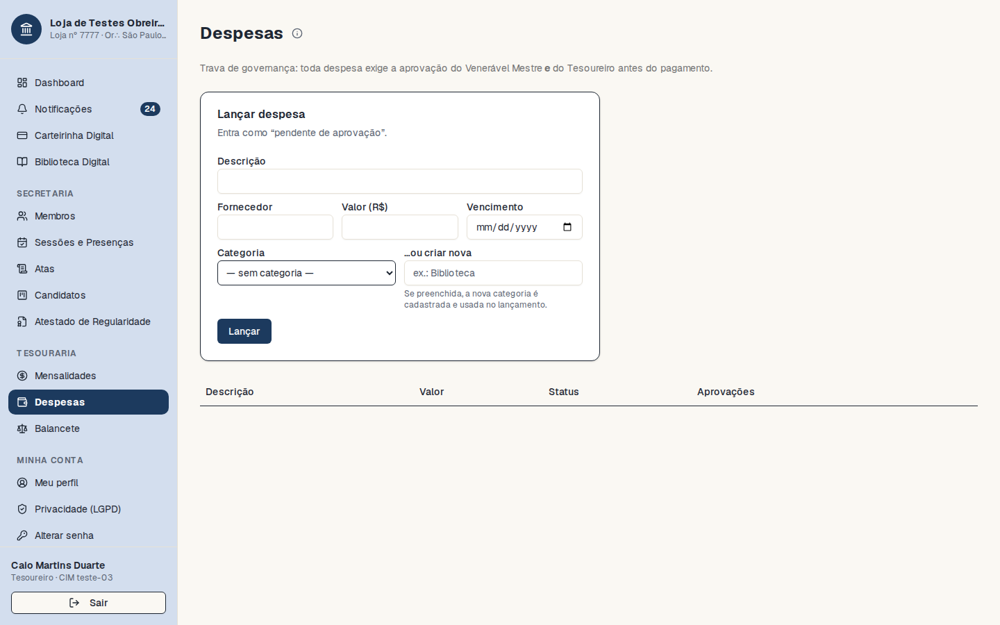

- **Duração:** ~50 s.
- **Na tela:** lançar despesa → status pendente de aprovação → aprovação do Tesoureiro E do VM → pagamento → entrada automática no livro-caixa.
- **Narração:**

> Nenhuma despesa da Loja é paga por decisão de uma só pessoa. Ao lançar uma despesa, ela nasce pendente — e precisa de duas aprovações: a do Tesoureiro e a do Venerável Mestre. É a trava de governança que protege o patrimônio da Oficina e quem a administra. Aprovada e paga, a despesa entra automaticamente no livro-caixa do balancete, na categoria certa. Controle a quatro mãos, prestação de contas sem surpresas.

## 3.4 — Balancete (`tesoureiro-balancete.mp4`)

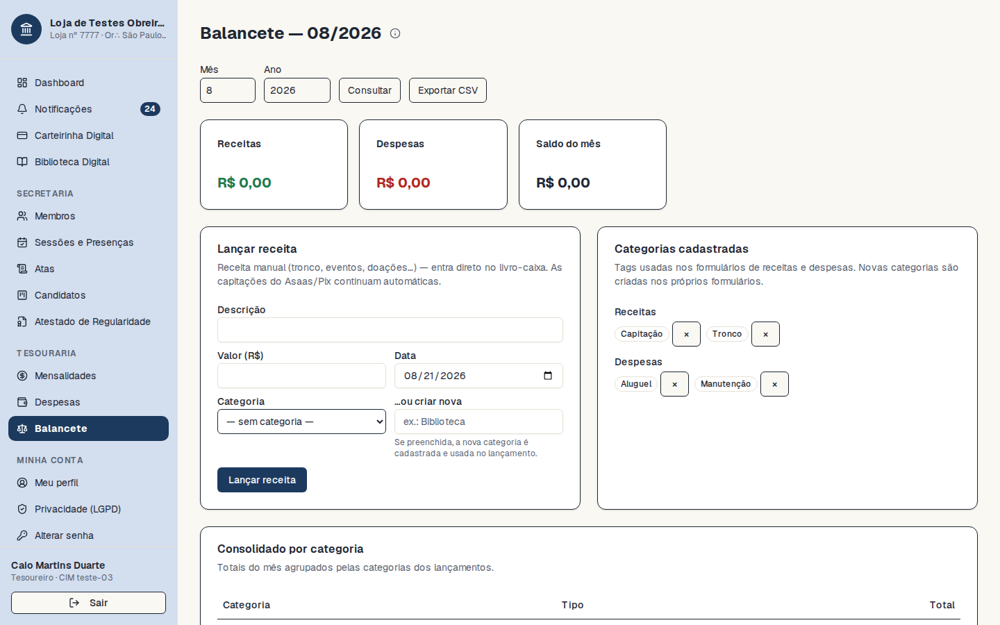

- **Duração:** ~45 s.
- **Na tela:** livro-caixa do mês → receitas por categoria (capitações, tronco, eventos) → despesas → lançar receita manual → exportar CSV.
- **Narração:**

> O Balancete é o livro-caixa da Loja, mês a mês: de um lado, as receitas — capitações, tronco de beneficência, eventos e doações; do outro, as despesas pagas, com totais por categoria. Entradas avulsas você registra em "Lançar receita". E, na hora da prestação de contas, exporte tudo em CSV para levar à Loja ou ao Conselho de Contas. Transparência que se demonstra em números.

## 3.5 — Atestado de Regularidade (assinatura do Tesoureiro) (`tesoureiro-atestado.mp4`)

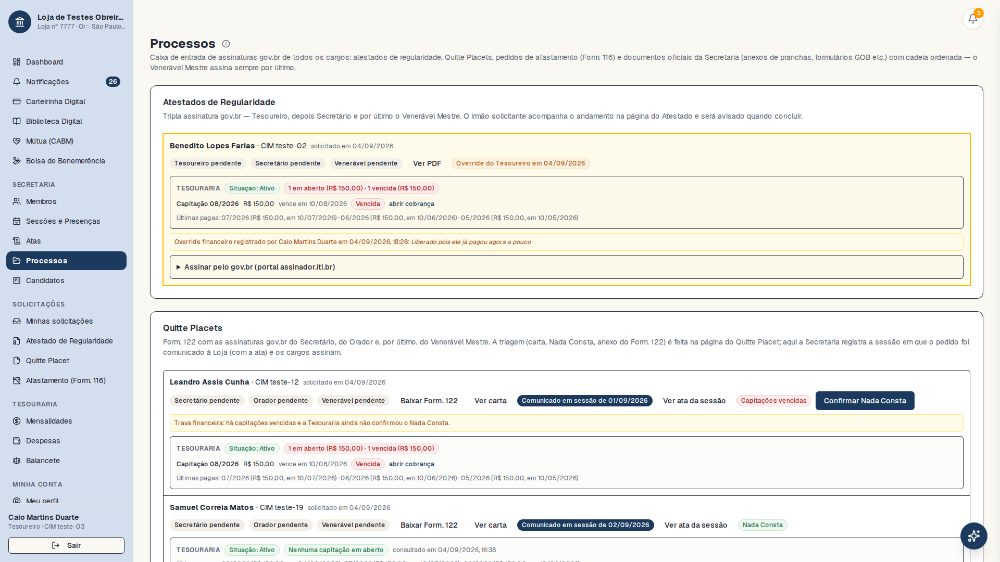

- **Duração:** ~50 s.
- **Na tela:** notificação e card no dashboard "é a vez do Tesoureiro" → página de atestados → assinar com senha OU baixar PDF, assinar no gov.br (portal) e subir → segue ao Secretário.
- **Narração:**

> Quando um irmão solicita o Atestado de Regularidade, você é o primeiro da fila — afinal, é o Tesoureiro quem atesta que o irmão está em dia com os metais. O sistema avisa no seu painel e na central de notificações. Você assina de duas formas: com a sua senha, aplicando a imagem da sua assinatura ao PDF; ou pelo gov.br — baixa o documento, assina no portal oficial com a sua conta, e sobe o arquivo assinado. A sua assinatura abre o caminho: em seguida, o atestado passa ao Secretário e, por fim, ao Venerável Mestre.

---

# PARTE 4 — VENERÁVEL MESTRE

O VM tem visão total: menus da Secretaria, da Tesouraria e da gestão da Loja.

## 4.1 — Dashboard do Venerável (`veneravel-dashboard.mp4`)

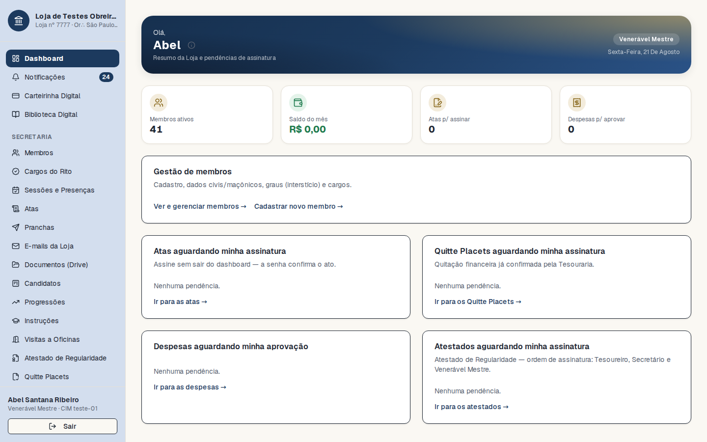

- **Duração:** ~60 s.
- **Na tela:** membros ativos, saldo do mês, atas para assinar, despesas para aprovar → alerta vermelho de comunicações em atraso → cards: atas aguardando minha assinatura (assinar inline), Quitte Placets, despesas, atestados na minha vez.
- **Narração:**

> O painel do Venerável Mestre é o posto de comando da Loja. No topo, os números essenciais: membros ativos, saldo do mês, atas aguardando a sua assinatura e despesas aguardando a sua aprovação. Se algum prazo regulamentar estiver estourado — como a comunicação de quinze dias após uma cerimônia — um alerta vermelho salta à vista. E o melhor: as pendências se resolvem dali mesmo. Atas, Quitte Placets e atestados na sua vez podem ser assinados sem sair do painel, com a confirmação por senha. Malhete na mão, decisões na tela.

## 4.2 — Assinaturas do Venerável (`veneravel-assinaturas.mp4`)

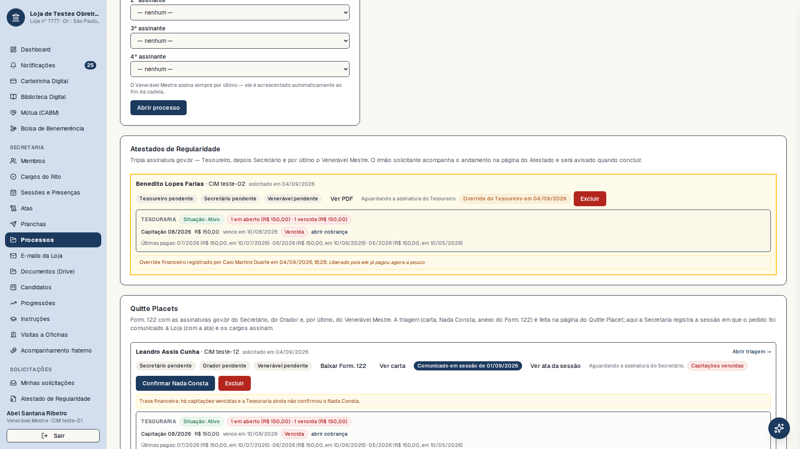

- **Duração:** ~70 s.
- **Na tela:** assinar ata inline (senha) → assinar Quitte Placet → atestado (último da fila: senha ou gov.br) → mostrar alternativa gov.br.
- **Narração:**

> Boa parte do dia a dia do Venerável são as assinaturas — e o sistema as organiza todas. Nas atas, o Venerável assina primeiro, e o Secretário sela em seguida. Nos Quitte Placets, a dupla assinatura com o Secretário, sempre depois do Nada Consta da Tesouraria. No Atestado de Regularidade, a sua é a assinatura final, depois do Tesoureiro e do Secretário — é ela que conclui o documento. Em todos os casos, dois caminhos: a assinatura no sistema, confirmada por senha e com a imagem da sua assinatura no PDF; ou a assinatura digital do gov.br, com validade jurídica plena, feita no portal oficial. A autoridade do cargo, com a praticidade da tecnologia.

## 4.3 — Governança e travas do sistema (`veneravel-governanca.mp4`)

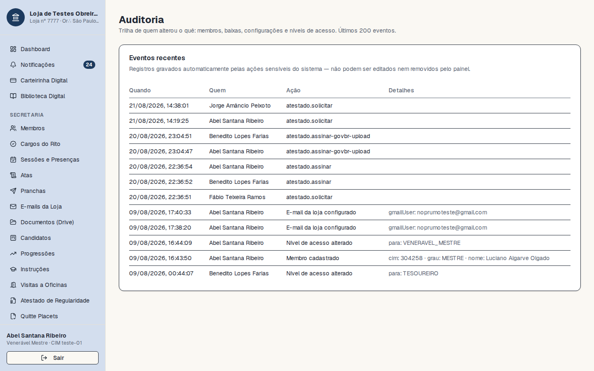

- **Duração:** ~60 s.
- **Na tela:** despesa exigindo VM + Tesoureiro → Quitte Placet travado sem Nada Consta → progressão travada sem frequência/instruções → auditoria.
- **Narração:**

> O NoPrumo foi desenhado para que as regras da Ordem se cumpram por construção. Nenhuma despesa é paga sem as duas aprovações — a sua e a do Tesoureiro. Nenhum Quitte Placet é emitido sem o Nada Consta da Tesouraria. Nenhuma progressão avança sem interstício, instruções e frequência em dia. E cada ação sensível fica registrada na auditoria: quem fez, o quê e quando. Para o Venerável, isso significa tranquilidade: a Loja funciona conforme o rito e o regulamento, e o sistema é testemunha de tudo.

## 4.4 — Visão financeira do Venerável (`veneravel-financeiro.mp4`)

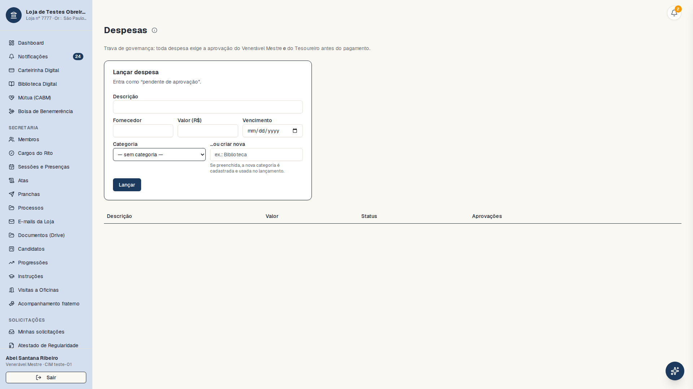

- **Duração:** ~40 s.
- **Na tela:** menus da Tesouraria em modo VM: mensalidades, despesas (aprovar), balancete.
- **Narração:**

> O Venerável acompanha as finanças lado a lado com o Tesoureiro: as mensalidades e a inadimplência, as despesas — que dependem também da sua aprovação — e o balancete completo, mês a mês. Nada acontece no caixa da Loja fora do seu campo de visão.

## 4.5 — Configurações e auditoria (visão do VM) (`veneravel-config.mp4`)

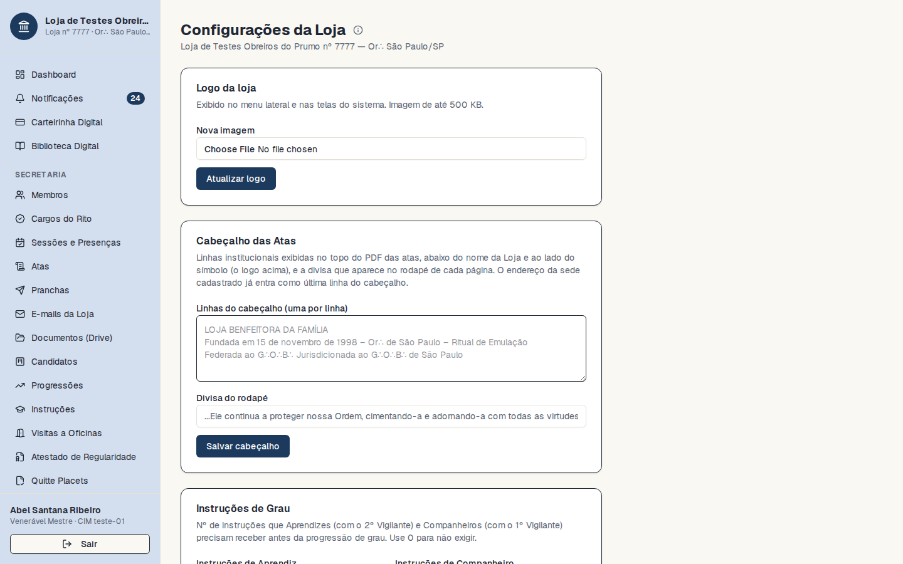

- **Duração:** ~40 s.
- **Na tela:** Configurações da Loja → parâmetros de governança (frequência mínima, limite de inadimplência) → Auditoria.
- **Narração:**

> É nas Configurações da Loja que o Venerável e o Secretário definem as regras do jogo: a frequência mínima para progressão, o limite de inadimplência, as integrações e a identidade visual dos documentos. E na Auditoria, o registro fiel de todas as ações da gestão. Parâmetros claros, história registrada.

---

# PARTE 5 — CONSELHO DE CONTAS

## 5.1 — Painel e fiscalização (`conselho-fiscalizacao.mp4`)

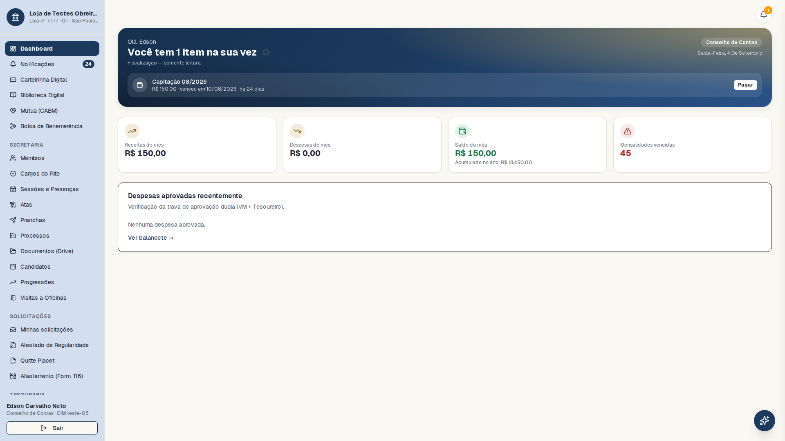

- **Duração:** ~60 s.
- **Na tela:** dashboard somente leitura: resultado do ano, despesas recentes, inadimplência → navegar por mensalidades, despesas, balancete → exportar CSV → tudo sem botões de edição.
- **Narração:**

> Ao Conselho de Contas cabe fiscalizar — e o sistema dá ao Conselho exatamente o que ele precisa: acesso completo, em modo somente leitura. O painel mostra o resultado financeiro do ano, as despesas recentes e a inadimplência. Dali, o conselheiro navega pelas mensalidades, pelas despesas — verificando as duplas aprovações — e pelo balancete de cada mês, com exportação em CSV para o parecer. Ver tudo, sem poder alterar nada: é a independência que a fiscalização exige.

---

# PARTE 6 — ESMOLER (HOSPITALEIRO)

## 6.1 — Alertas de bem-estar (`esmoler-alertas.mp4`)

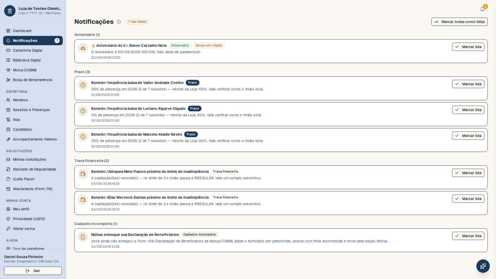

- **Duração:** ~50 s.
- **Na tela:** notificações dirigidas ao Esmoler: irmão próximo do limite de inadimplência → irmão com frequência baixa → contato preventivo.
- **Narração:**

> O Esmoler é os olhos e o coração da Loja voltados ao bem-estar dos irmãos — e o sistema trabalha ao seu lado. Quando um irmão acumula mensalidades vencidas e se aproxima do limite que o tornaria irregular, o Esmoler recebe um aviso reservado: talvez seja hora de um contato fraterno, antes que o problema cresça. O mesmo vale para a frequência: se um irmão começa a faltar além do normal, o alerta chega — porque atrás de uma ausência pode haver uma dificuldade. Tecnologia a serviço da fraternidade: é para isso que esses alertas existem.

---

# PARTE 7 — VIGILANTES (INSTRUTORES)

## 7.1 — Instruções de grau (`vigilantes-instrucoes.mp4`)

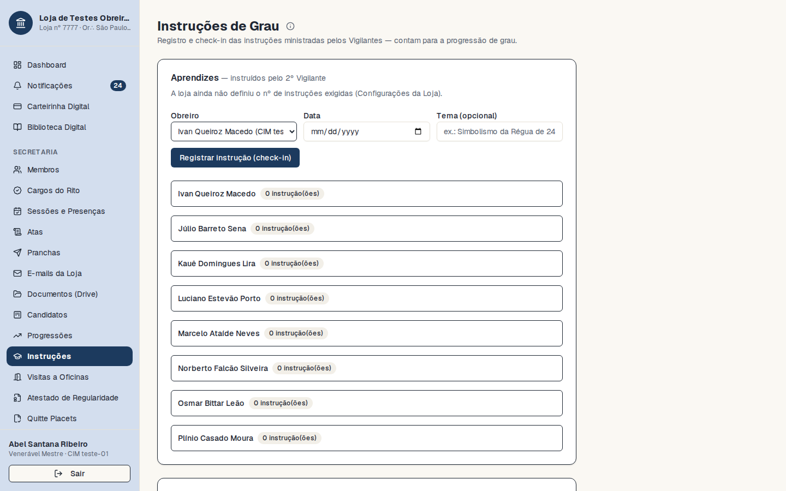

- **Duração:** ~45 s.
- **Na tela:** menu Instruções (aparece para quem tem cargo de Vigilante) → registrar instrução dada → meta configurada pela Loja → progresso de cada irmão → trava na progressão.
- **Narração:**

> Aos Vigilantes cabe instruir: o Segundo Vigilante forma os Aprendizes; o Primeiro, os Companheiros. No menu Instruções, o Vigilante registra cada instrução ministrada e acompanha o progresso de cada irmão rumo à meta definida pela Loja. Esses registros não são apenas memória: são requisito — sem as instruções em dia, o processo de progressão de grau não avança. Ensinar, registrar, e ver o irmão pronto para subir mais um degrau.

---

# PARTE 8 — ADMINISTRADOR DA PLATAFORMA (opcional)

## 8.1 — Administração do SaaS (`admin-plataforma.mp4`)

- **Duração:** ~40 s. (Vídeo interno/comercial — não faz parte do tour das Lojas. Sem print: a tela exige conta de super admin.)
- **Na tela:** painel /admin → criar Loja → licença e cobrança → backup automático no Drive.
- **Narração:**

> Para quem administra a plataforma, o painel de Administração concentra a gestão das Lojas: criação de novas Oficinas, licenças e cobranças, e o backup automático de todas as bases no Google Drive. Cada Loja é um ambiente isolado, com seus dados, suas integrações e seus usuários — a segurança de um sistema profissional, com a simplicidade de um clique.

---

## Checklist de produção

| # | Arquivo | Cargo | Status |
|---|---------|-------|--------|
| 1.1 | obreiro-login.mp4 | Obreiro | ☐ |
| 1.2 | obreiro-dashboard.mp4 | Obreiro | ☐ |
| 1.3 | obreiro-notificacoes.mp4 | Obreiro | ☐ |
| 1.4 | obreiro-carteirinha.mp4 | Obreiro | ☐ |
| 1.5 | obreiro-biblioteca.mp4 | Obreiro | ☐ |
| 1.6 | obreiro-sessoes.mp4 | Obreiro | ☐ |
| 1.7 | obreiro-atas.mp4 | Obreiro | ☐ |
| 1.8 | obreiro-candidatos.mp4 | Obreiro | ☐ |
| 1.9 | obreiro-atestado.mp4 | Obreiro | ☐ |
| 1.10 | obreiro-conta.mp4 | Obreiro | ☐ |
| 2.1 | secretario-dashboard.mp4 | Secretário | ☐ |
| 2.2 | secretario-membros.mp4 | Secretário | ☐ |
| 2.3 | secretario-cargos.mp4 | Secretário | ☐ |
| 2.4 | secretario-sessoes.mp4 | Secretário | ☐ |
| 2.5 | secretario-atas.mp4 | Secretário | ☐ |
| 2.6 | secretario-pranchas.mp4 | Secretário | ☐ |
| 2.7 | secretario-emails.mp4 | Secretário | ☐ |
| 2.8 | secretario-documentos.mp4 | Secretário | ☐ |
| 2.9 | secretario-admissoes.mp4 | Secretário | ☐ |
| 2.10 | secretario-progressoes.mp4 | Secretário | ☐ |
| 2.11 | secretario-visitas.mp4 | Secretário | ☐ |
| 2.12 | secretario-atestado.mp4 | Secretário | ☐ |
| 2.13 | secretario-quitte.mp4 | Secretário | ☐ |
| 2.14 | secretario-config.mp4 | Secretário | ☐ |
| 3.1 | tesoureiro-dashboard.mp4 | Tesoureiro | ☐ |
| 3.2 | tesoureiro-mensalidades.mp4 | Tesoureiro | ☐ |
| 3.3 | tesoureiro-despesas.mp4 | Tesoureiro | ☐ |
| 3.4 | tesoureiro-balancete.mp4 | Tesoureiro | ☐ |
| 3.5 | tesoureiro-atestado.mp4 | Tesoureiro | ☐ |
| 4.1 | veneravel-dashboard.mp4 | Venerável | ☐ |
| 4.2 | veneravel-assinaturas.mp4 | Venerável | ☐ |
| 4.3 | veneravel-governanca.mp4 | Venerável | ☐ |
| 4.4 | veneravel-financeiro.mp4 | Venerável | ☐ |
| 4.5 | veneravel-config.mp4 | Venerável | ☐ |
| 5.1 | conselho-fiscalizacao.mp4 | Conselho | ☐ |
| 6.1 | esmoler-alertas.mp4 | Esmoler | ☐ |
| 7.1 | vigilantes-instrucoes.mp4 | Vigilantes | ☐ |
| 8.1 | admin-plataforma.mp4 | Admin | ☐ |
