# Roteiros de Vídeos — NoPrumo (por menu e por cargo)

Documento de produção para gravar **um vídeo por menu**, separado por cargo, com narração pronta para gerar no **ElevenLabs**. Cada roteiro traz: objetivo, duração sugerida, o passo a passo do que capturar na tela e o texto de narração completo.

## Orientações gerais de produção

- **Voz (ElevenLabs):** voz masculina adulta em português do Brasil, tom acolhedor e institucional, ritmo calmo (velocidade ~0,95). Público de faixa etária variada — pausas claras entre frases.
- **Pronúncias:** "gov.br" = "góv ponto bê érre"; "NoPrumo" = "No-Prumo" (junto); "CIM" = "cim" (uma sílaba); "Ir∴" ler como "Irmão"; "QR Code" = "quê-érre côde"; "Pix", "Asaas", "Drive" e "Gmail" como se falam usualmente.
- **Captura:** gravar em `https://teste.noprumo.ia.br` (staging) com a **Loja de Testes nº 7777** (senha `teste123`: `teste-01` VM, `teste-02` Secretário, `teste-03` Tesoureiro, `teste-04` Esmoler, `teste-05` Conselho, `teste-06` 1º Vigilante, `teste-10` Orador, `teste-12` Obreiro) ou a **demo 9999** (contas demo-vm, demo-sec, demo-tes…). Resolução 1920×1080, cursor visível, sem dados reais.
- **Estrutura padrão de cada vídeo:** 3 s de tela do menu parado → ação narrada → encerramento no resultado final. Sem música alta por cima da narração.
- **Nomenclatura dos arquivos:** `cargo-menu.mp4` (ex.: `obreiro-carteirinha.mp4`, `secretario-atas.mp4`).

---

# PARTE 1 — OBREIRO (todo irmão do quadro)

O Obreiro comum vê: Dashboard (com a faixa "Minha vez" e o sino), Notificações, Carteirinha Digital, Biblioteca Digital, Mútua (CABM), Bolsa de Benemerência, Membros, Sessões e Presenças, Atas, Candidatos, Solicitações (Minhas solicitações, Atestado de Regularidade, Quitte Placet, Afastamento — Form. 116), Meu perfil, Privacidade (LGPD), Alterar senha, Tour e o Assistente da Loja.

## 1.1 — Login e primeiro acesso (`obreiro-login.mp4`)

- **Objetivo:** mostrar como entrar no sistema.
- **Duração:** ~45 s.
- **Na tela:** abrir noprumo.ia.br → digitar CIM e senha → botão Entrar → se for filiado a mais de uma Loja, aparece a escolha da Loja → dashboard. Mostrar também o link "Esqueci minha senha" (código por e-mail).
- **Narração:**

> Bem-vindo ao NoPrumo, o sistema de gestão da sua Loja. Para entrar, acesse o endereço da plataforma e informe o seu CIM — o número do seu Cadastro de Identificação Maçônica — e a sua senha. No primeiro acesso, a senha provisória é o seu CPF, e o sistema pedirá que você crie uma senha nova e pessoal. Se você é filiado a mais de uma Loja, o sistema pergunta em qual delas deseja entrar. E se esquecer a senha, use o botão "Esqueci minha senha": você recebe um código de confirmação no seu e-mail e cadastra uma senha nova na hora. Simples, rápido e seguro.

## 1.2 — Dashboard do Obreiro: "Minha vez" e o sino (`obreiro-dashboard.mp4`)

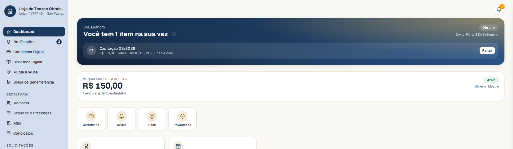

- **Objetivo:** visão geral pessoal do irmão, começando pelo que está esperando por ele. Este vídeo também serve de introdução à faixa "Minha vez" e ao sino do cabeçalho, comuns a todos os cargos.
- **Duração:** ~75 s.
- **Na tela:** dashboard após login: faixa azul "Olá, [nome] — Você tem N itens na sua vez" (ou "Nada pendente com você") com a lista de pendências, cada uma com contexto, "há X dias" e o botão de ação (Pagar, Responder, Acompanhar…) → clicar num item e mostrar que abre direto no lugar certo → voltar → sino no canto superior direito com a contagem → abrir o menu do sino: "Minha vez · N item(ns)" e "Últimas notificações" → cartões: mensalidades em aberto, situação, grau, "Frequência no ano" (presenças em sessões do seu grau) → card "Minhas solicitações" com a etiqueta "Pendente com: Tesouraria (Nada Consta)" / "Pendente com: Secretário" → aniversários.
- **Narração:**

> Este é o seu painel de entrada — e ele começa pelo que importa agora. A faixa "Minha vez", no topo, reúne tudo o que está esperando por você: uma mensalidade a pagar, um convite de sessão sem resposta, um pedido seu para acompanhar. Cada item diz há quantos dias está ali e traz o botão da ação: um clique, e você já está na tela certa. Se não houver nada, a faixa diz simplesmente "Nada pendente com você". No canto superior, o sino mostra a mesma contagem e as últimas notificações — cada aviso abre o item exato, e é marcado como lido na hora. Logo abaixo, o resumo da sua vida maçônica: a situação na Loja, o grau, a frequência do ano — calculada sobre as sessões do seu grau — e as mensalidades em aberto, com o botão para pagar por cartão, boleto ou Pix. E o card "Minhas solicitações" diz, para cada pedido seu, com quem ele está pendente neste momento: com o Tesoureiro, com a Secretaria, com o Venerável. Você nunca precisa perguntar onde parou.

## 1.3 — Notificações (`obreiro-notificacoes.mp4`)

- **Objetivo:** central de avisos e avisos de evento por e-mail.
- **Duração:** ~50 s.
- **Na tela:** sino no cabeçalho (contagem "Minha vez" + últimas notificações) → clicar num aviso: abre o item exato (ex.: card destacado em Processos ou a solicitação) já marcado como lido → página de Notificações agrupada por tipo (aniversário, cadastro incompleto, financeiro, solicitações) → botão "Marcar lida" → mostrar (mock) o e-mail recebido: "Capitação emitida", "Pagamento recebido", "Sua solicitação avançou: Pendente com o Secretário" e o e-mail final com o PDF anexo.
- **Narração:**

> O sino de notificações é a central de avisos do sistema. Para você, Obreiro, chegam aqui os avisos que dizem respeito à sua caminhada: uma capitação emitida, um pagamento confirmado, uma mudança na sua situação, o aniversário de um irmão — e cada etapa das suas solicitações, do atestado ao afastamento. Cada aviso é um atalho: clicou, o sistema abre o item exato, já destacado na tela, e marca o aviso como lido. Os mesmos avisos chegam ao seu e-mail, e, quando um pedido seu é concluído, o documento assinado vai anexado. O número no sino mostra quantos itens ainda aguardam você — e, quando a pendência é resolvida, o aviso desaparece sozinho. Nada de bagunça: só o que precisa da sua atenção.

## 1.4 — Carteirinha Digital (`obreiro-carteirinha.mp4`)

- **Objetivo:** identificação digital com QR Code.
- **Duração:** ~45 s.
- **Na tela:** menu Carteirinha Digital → carteirinha com foto, nome, CIM, grau e QR Code → simular leitura do QR (página pública de verificação) → botão de imprimir.
- **Narração:**

> A sua Carteirinha Digital é a sua identificação maçônica no celular. Ela traz a sua foto, o seu nome, o CIM, o grau e um QR Code de verificação. Ao visitar outra Loja, basta apresentar a tela: quem escanear o código vê, na hora, a confirmação de que você é membro regular do quadro. Se preferir o papel, use o botão de imprimir e leve a versão física. Sua identidade maçônica, sempre à mão.

## 1.5 — Biblioteca Digital (`obreiro-biblioteca.mp4`)

- **Objetivo:** acervo de estudos.
- **Duração:** ~35 s.
- **Na tela:** menu Biblioteca → categorias/lista de itens → abrir um item → download.
- **Narração:**

> A Biblioteca Digital é o acervo da Loja ao alcance de todos os irmãos: livros, rituais, decretos e regulamentos, organizados para consulta e download a qualquer hora. A Secretaria mantém o acervo atualizado — e você estuda no seu ritmo, do computador ou do celular.

## 1.6 — Sessões, presença por QR Code e Livro de Presenças (`obreiro-sessoes.mp4`)

- **Objetivo:** agenda e check-in.
- **Duração:** ~60 s.
- **Na tela:** menu Sessões e Presenças → lista de sessões → QR Code de check-in exibido na sessão → celular escaneando e confirmando presença → Livro de Presenças com a frequência anual.
- **Narração:**

> Em Sessões e Presenças você acompanha a agenda da Loja: data, tipo de sessão — Ordinária, Magna, Econômica, Branca ou Evento — e grau. No dia da sessão, a presença é registrada de um jeito moderno: um QR Code é exibido na entrada, você aponta a câmera do celular, confirma — e pronto, presença lançada. Visitantes de outras Lojas também fazem o check-in pelo mesmo código, e recebem um certificado de visita. Tudo alimenta o Livro de Presenças, que mostra a frequência anual de cada irmão — um dado importante, porque a frequência mínima é requisito para a progressão de grau.

## 1.7 — Atas (visão do Obreiro) (`obreiro-atas.mp4`)

- **Objetivo:** validação da minuta por e-mail e consulta.
- **Duração:** ~40 s.
- **Na tela:** menu Atas → lista com status → abrir uma ata assinada → mostrar (mock) o e-mail de validação da minuta.
- **Narração:**

> As atas da Loja ficam disponíveis para consulta no menu Atas. Antes de uma ata ser assinada, a minuta é enviada por e-mail a todos os irmãos para validação — você lê e, se for o caso, sugere ajustes, tudo antes da assinatura. Depois de assinada pelo Venerável e pelo Secretário, a versão final fica selada e arquivada. Transparência do início ao fim.

## 1.8 — Candidatos: apadrinhar (`obreiro-candidatos.mp4`)

- **Objetivo:** qualquer irmão pode indicar um candidato.
- **Duração:** ~50 s.
- **Na tela:** menu Candidatos → botão de novo candidato → cadastro inicial → link pessoal gerado → (aba anônima) página do candidato com formulários pré-preenchidos.
- **Narração:**

> Conhece alguém pronto para bater às portas do Templo? Qualquer irmão pode apadrinhar um candidato. No menu Candidatos, faça o cadastro inicial com os dados básicos. O sistema gera um link pessoal e exclusivo: você envia ao candidato, e ele mesmo baixa os formulários de indicação — já preenchidos com os dados da Loja — e os devolve preenchidos pela própria página. A partir daí, a Secretaria conduz as etapas seguintes: edital, sindicância, escrutínio e o Placet da Potência. Apadrinhar nunca foi tão organizado.

## 1.9 — Atestado de Regularidade (`obreiro-atestado.mp4`)

- **Objetivo:** solicitar o atestado e acompanhar, na linha do tempo, com quem a assinatura está pendente — e entender por que um irmão em atraso não consegue pedir.
- **Duração:** ~60 s.
- **Na tela:** menu Atestado de Regularidade → botão "Solicitar Atestado de Regularidade" → linha do tempo Tesoureiro → Secretário → Venerável Mestre com a etiqueta "Pendente com: Tesoureiro" → o mesmo pedido no card "Minhas solicitações" do dashboard e na faixa "Minha vez" → (mock) o e-mail "O Tesoureiro assinou o seu atestado" a cada etapa → atestado concluído ("Documento pronto") → botões Ver PDF / Baixar PDF e o e-mail final com o PDF anexo. Mostrar também (conta com capitação vencida) o aviso de que o pedido fica travado enquanto houver capitação vencida.
- **Narração:**

> Precisa comprovar que está regular com a Loja? O Atestado de Regularidade declara que você é membro efetivo e está em dia com os metais e demais deveres maçônicos. Qualquer irmão ativo pode solicitar: um clique, e o pedido segue automaticamente para as três assinaturas digitais do gov.br — primeiro o Tesoureiro, que confere a Tesouraria; depois o Secretário; e, por fim, o Venerável Mestre. Uma regra clara: se houver capitação vencida, o pedido fica travado até a quitação — e só o Tesoureiro pode liberá-lo, com justificativa registrada. A partir da solicitação, você só acompanha: a linha do tempo mostra com quem o documento está pendente, e a cada assinatura você recebe um aviso no sistema e no e-mail. Quando o Venerável conclui, aparece "Documento pronto" — o PDF assinado fica disponível aqui e chega anexado ao seu e-mail.

## 1.10 — Meu perfil, Privacidade e senha (`obreiro-conta.mp4`)

- **Objetivo:** dados pessoais, foto, LGPD.
- **Duração:** ~45 s.
- **Na tela:** Meu perfil (foto, contato) → Privacidade LGPD (baixar meus dados, solicitar exclusão) → Alterar senha.
- **Narração:**

> Em Minha Conta, você cuida dos seus dados. No Meu Perfil, atualize a foto — que aparece na carteirinha — e as informações de contato. Na área de Privacidade, o sistema cumpre a Lei Geral de Proteção de Dados: você pode baixar uma cópia de tudo o que a Loja guarda sobre você e, se um dia deixar o quadro, solicitar a exclusão dos seus dados. E em Alterar Senha, mantenha o seu acesso sempre seguro. Seus dados, sob o seu controle.

---

## 1.11 — Meu Quitte Placet (`obreiro-quitte.mp4`)

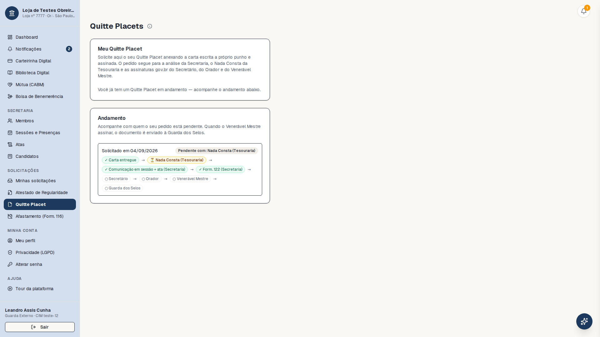

- **Objetivo:** o irmão pede o próprio Quitte Placet e acompanha com quem está pendente.
- **Duração:** ~60 s.
- **Na tela:** menu Quitte Placet → card "Meu Quitte Placet" → motivo + anexar a carta de próprio punho (foto ou PDF) → Solicitar → card "Andamento" com a linha do tempo: Carta entregue → Nada Consta (Tesouraria) → Sessão de comunicação e Form. 122 (Secretaria) → Secretário → Orador → Venerável Mestre → Guarda dos Selos → etiqueta "Pendente com: Tesouraria (Nada Consta)" → o mesmo item em "Minhas solicitações" no dashboard → ao final, "Enviado à Guarda dos Selos", botão Baixar documento e a situação do irmão como Ex-membro. Mostrar também um pedido negado com o parecer exibido ao irmão.
- **Narração:**

> O Quitte Placet é o documento de desligamento ou transferência — e o pedido é do próprio irmão. No menu Quitte Placet, escreva o motivo e anexe a carta escrita a próprio punho e assinada: sem ela, o pedido não é registrado. A partir daí, você só acompanha. A linha do tempo mostra cada etapa — a carta; o Nada Consta da Tesouraria, que considera apenas as capitações vencidas e é atualizado assim que você paga; a sessão em que o pedido é comunicado à Loja e o formulário oficial; e as três assinaturas do gov.br: o Secretário, o Orador e o Venerável Mestre — e diz, a cada momento, com quem o pedido está pendente. Se a Loja negar, você vê o parecer aqui mesmo. Concluído e enviado à Guarda dos Selos, o documento assinado fica disponível para download, e a sua situação na Loja é atualizada automaticamente. Transparência do início ao fim.

## 1.12 — Mútua (CABM): Declaração de Beneficiários (`obreiro-mutua.mp4`)

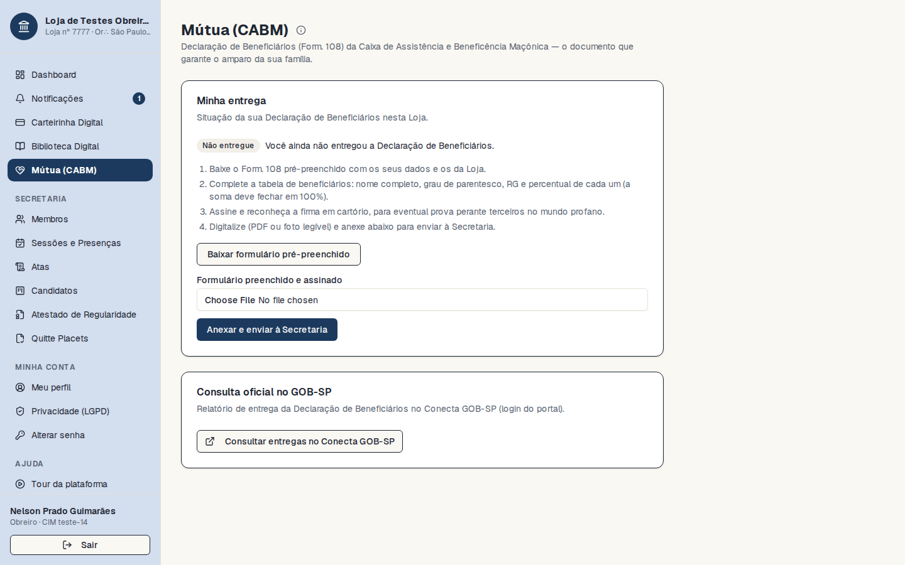

- **Objetivo:** o irmão confere se entregou a Declaração de Beneficiários e, se não, entrega sem sair do sistema.
- **Duração:** ~55 s.
- **Na tela:** menu Mútua (CABM) → card "Minha entrega" com a etiqueta Não entregue e o passo a passo → botão "Baixar formulário pré-preenchido" (Form. 108 já com nome, CIM, Loja, número, oriente e data) → anexar o formulário assinado → "Anexar e enviar à Secretaria" → etiqueta muda para Entregue → card "Consulta oficial no GOB-SP" com o botão do Conecta.
- **Narração:**

> A Mútua — a Caixa de Assistência e Beneficência Maçônica — é o amparo da sua família, e a Declaração de Beneficiários é o documento que garante esse direito. Na seção Mútua, você vê na hora se a sua declaração já foi entregue. Se ainda não foi, o sistema entrega o Formulário 108 pré-preenchido, com os seus dados e os da Loja — você só completa os beneficiários, com o grau de parentesco, o RG e o percentual de cada um, assina e reconhece a firma em cartório. Depois, é digitalizar, anexar e enviar: a Secretaria, o Venerável, o Tesoureiro e o Esmoler são avisados na hora, e a sua situação muda para Entregue. E, enquanto não entregar, o sistema lembra você nas notificações. Na mesma tela, um botão leva à consulta oficial do relatório de entregas no Conecta GOB-SP. Um documento simples — e uma tranquilidade enorme para quem você ama.

## 1.13 — Bolsa de Benemerência: doação por Pix (`obreiro-benemerencia.mp4`)

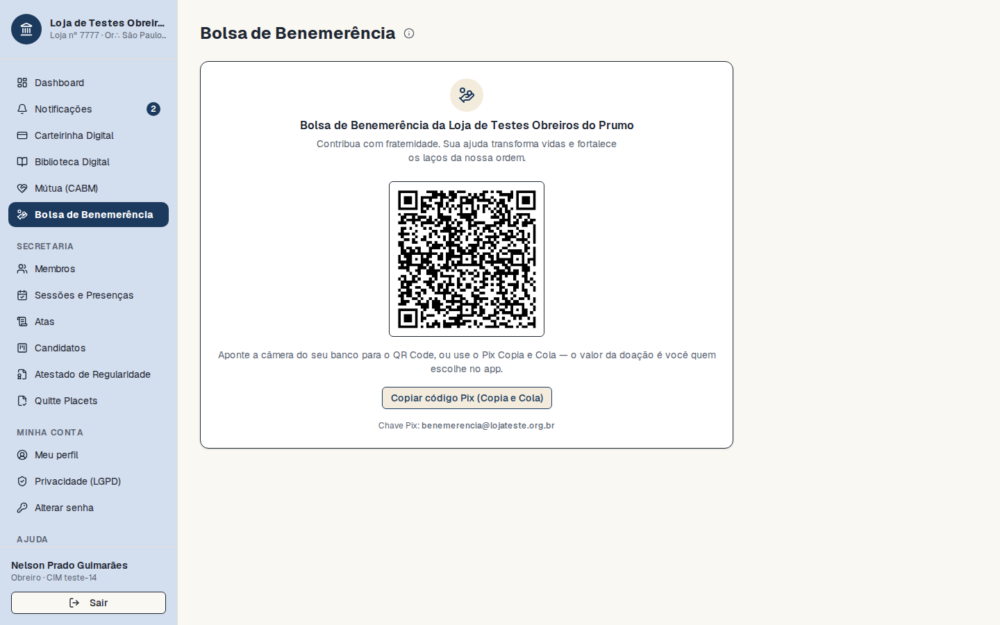

- **Objetivo:** o irmão faz uma doação à Bolsa de Benemerência da Loja em segundos.
- **Duração:** ~40 s.
- **Na tela:** menu Bolsa de Benemerência → card com a mensagem "Contribua com fraternidade. Sua ajuda transforma vidas e fortalece os laços da nossa ordem" → QR Code Pix na tela → celular do banco escaneando → botão "Copiar código Pix (Copia e Cola)" → chave Pix exibida por extenso.
- **Narração:**

> A Bolsa de Benemerência é a mão estendida da Loja — e contribuir ficou simples assim. Na seção Bolsa de Benemerência, você encontra o QR Code Pix da Loja: aponte a câmera do aplicativo do seu banco, escolha o valor que o coração mandar e confirme. Prefere o Copia e Cola? Um toque no botão e o código está na área de transferência. Contribua com fraternidade: sua ajuda transforma vidas e fortalece os laços da nossa ordem.

## 1.14 — Assistente da Loja (`obreiro-assistente.mp4`)

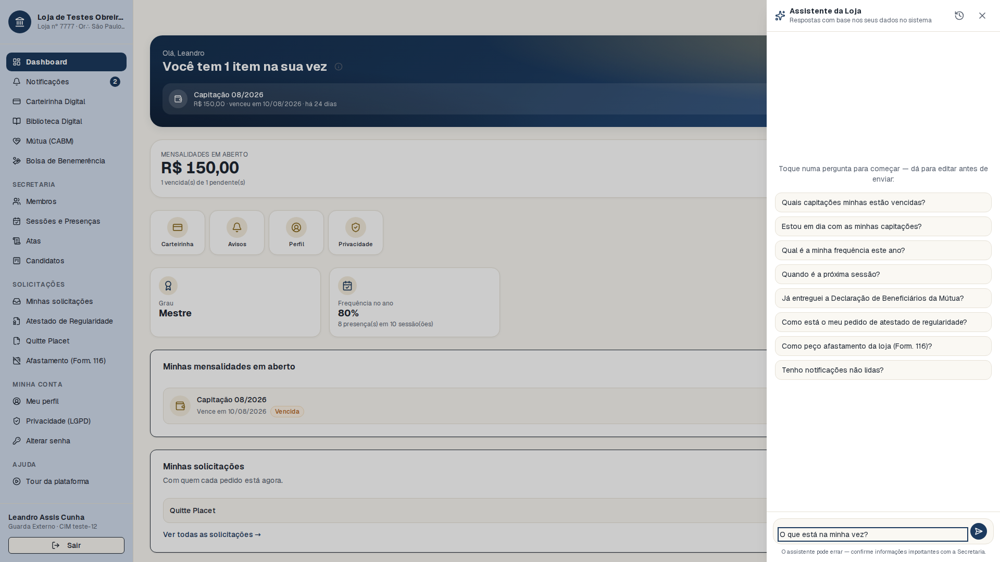

- **Objetivo:** mostrar o assistente conversacional, agora proativo: ele sabe o que está na vez do irmão.
- **Duração:** ~55 s.
- **Na tela:** botão do assistente no canto inferior direito → painel lateral abre → chips de sugestão no topo, com os dinâmicos primeiro ("Quais capitações minhas estão vencidas?", "Que convites de sessão ainda não respondi?") → clicar num chip (preenche sem enviar) → perguntar "O que está na minha vez?" → resposta com a lista e links clicáveis que abrem cada item → uma pergunta comum ("Qual é a minha frequência este ano?") → histórico de conversas (relógio) e "Nova conversa". Numa conta de Secretário, mostrar a pergunta "Como está a situação financeira do irmão [nome]?" para um irmão com processo em andamento.
- **Narração:**

> No canto da tela mora o Assistente da Loja — e ele já sabe por onde você deve começar. Ao abrir, as primeiras sugestões são as suas pendências: uma capitação vencida, um convite sem resposta, um documento para assinar. Toque numa sugestão, complete se quiser, e envie. Pergunte "O que está na minha vez?" e a resposta vem com links: um clique leva ao item. O assistente responde pelo que você tem direito de ver — a sua frequência, as suas capitações, as atas, a biblioteca — e, para quem tem cargo, vai além: o Secretário pode perguntar a situação financeira de um irmão que tem processo em andamento, antes de dar o próximo passo. As conversas ficam guardadas, e você retoma quando quiser. É a Loja respondendo, com educação e com dados.

## 1.15 — Balancete da Loja (`obreiro-balancete.mp4`)

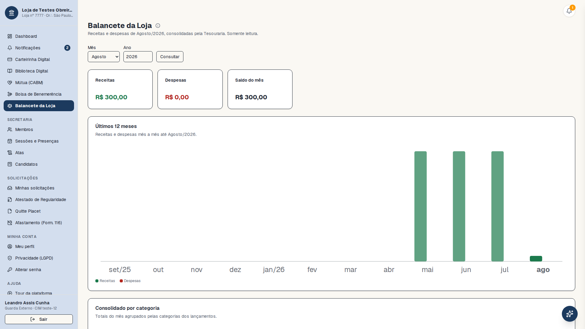

- **Objetivo:** mostrar que todo irmão consulta o balancete mensal da Loja, só leitura e sem nomes.
- **Duração:** ~40 s.
- **Na tela:** menu Balancete da Loja → seletor "Mês fechado" (só os meses já fechados pela Tesouraria) → badge "Fechado · ciência do Conselho" com o carimbo "Fechado por X em data · Ciência do Conselho por Y em data" → cards Receitas, Despesas e Saldo do mês (totais gravados no fechamento) → gráfico dos últimos 12 meses, com os meses ainda abertos vazios e marcados "aberto" → tabela "Consolidado por categoria" → tabela "Lançamentos do mês" com a linha única "Capitações recebidas — N irmãos" e a beneficência só no consolidado → rodapé "Balancete fechado pela Tesouraria e submetido à ciência do Conselho". Mostrar também a mensagem "A Tesouraria ainda não fechou nenhum mês" (loja nova). No assistente, o chip "Como fechou o balancete do mês passado?".
- **Narração:**

> Transparência é fraternidade. Na seção Balancete da Loja, qualquer irmão do quadro consulta as contas do mês: quanto entrou, quanto saiu e o saldo. Só aparecem os meses já fechados: o Tesoureiro fecha o mês, o Conselho de Contas registra a ciência — e o carimbo no topo mostra quem fechou e quem conferiu. O gráfico mostra os últimos doze meses, com os ainda abertos em branco; a tabela, os totais por categoria. Repare no cuidado: as capitações aparecem numa linha só — quantos irmãos pagaram e o total — e a beneficência entra apenas como valor da categoria. Nenhum nome, nenhuma situação individual. É o balancete fechado pela Tesouraria e conferido pelo Conselho, aberto para consulta; dúvidas, com o Tesoureiro ou o Conselho de Contas.

## 1.16 — Rifa de Benemerência: números e Pix (`obreiro-rifa.mp4`)

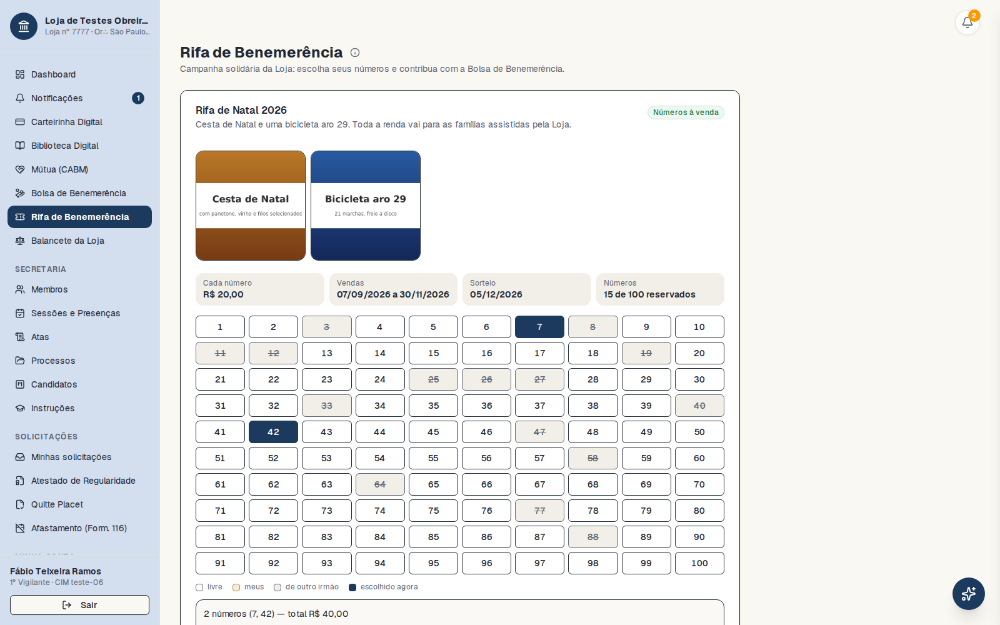

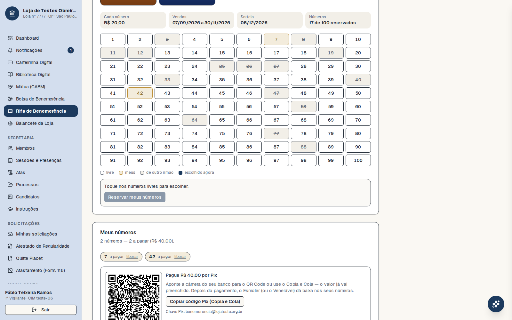

- **Objetivo:** o irmão participa da campanha solidária da Loja: escolhe os números, paga por Pix e acompanha o sorteio.
- **Duração:** ~60 s.
- **Na tela:** menu "Rifa de Benemerência" (só aparece com campanha vigente) → card da campanha com fotos do prêmio, valor do número, período de vendas e data do sorteio → grade de números: livres, "meus" (dourado) e "de outro irmão" (riscado) → tocar em dois números → "2 números (7, 42) — total R$ 40,00" → "Reservar meus números" → card "Meus números" com QR Code Pix no valor e "Copiar código Pix" → etiqueta "a pagar" vira "pago" após a baixa do Esmoler → botão "liberar" num número ainda não pago → depois do sorteio: card dourado "Número sorteado" com o ganhador (ou "Parabéns, o número sorteado é o seu!") e a semente para conferência.
- **Narração:**

> Quando a Loja abre uma rifa em favor da Benemerência, ela aparece aqui, no menu de todos os irmãos, com as fotos do prêmio, o valor de cada número e a data do sorteio. Escolher é tocar: os números livres estão em branco, os seus ficam dourados e os de outro irmão, riscados. Reservou? O sistema já monta o QR Code Pix com o valor exato — aponte a câmera do banco ou use o Copia e Cola. Pagou, o Esmoler dá a baixa e o número passa a "pago". Mudou de ideia antes de pagar? Libere o número. No dia do sorteio, o sistema aponta o irmão dono do número sorteado e avisa todo o quadro — e, se for o seu, os parabéns chegam aqui mesmo, com a semente do sorteio à vista para qualquer irmão conferir. Solidariedade com transparência, do primeiro número ao prêmio.

# PARTE 2 — SECRETÁRIO

O Secretário vê tudo do Obreiro e mais: Cargos do Rito, Pranchas, E-mails da Loja, Documentos (Drive), Processos, Progressões, Visitas a Oficinas, Visitantes, Quitte Placets, Configurações da Loja e Auditoria. O Esmoler e o Venerável veem ainda o Acompanhamento fraterno. Na Mútua, enxerga as entregas de todo o quadro.

## 2.1 — Dashboard do Secretário (`secretario-dashboard.mp4`)

- **Duração:** ~60 s.
- **Na tela:** faixa "Minha vez" no topo: assinaturas na vez do Secretário (atestado, Quitte, processo, Form. 116, ata), registros da Secretaria (sessão de comunicação do Quitte, Form. 122, candidato parado, prazo LGPD) com o botão Assinar / Registrar → sino no cabeçalho → cartões: membros ativos por grau, irregulares, atas pendentes, pranchas no ano → atas aguardando lavratura/assinatura → próximas sessões.
- **Narração:**

> O painel do Secretário é a mesa de trabalho da Loja — e a faixa "Minha vez" é a pilha que está sobre ela. Ali aparecem, em ordem de urgência, as assinaturas que aguardam o Secretário e os registros que só a Secretaria faz: a sessão em que um Quitte Placet foi comunicado, o formulário oficial a anexar, um candidato parado numa etapa, um pedido de exclusão de dados com prazo correndo. Cada item diz há quantos dias espera e abre direto no card certo. Nos cartões: o total de membros ativos, com o resumo por grau; os irmãos em situação irregular; as atas pendentes; e as pranchas expedidas no ano. Logo abaixo, as atas que aguardam lavratura ou assinatura e as próximas sessões. Um olhar, e você já sabe por onde começar o dia.

## 2.2 — Membros: o quadro de Obreiros (`secretario-membros.mp4`)

- **Duração:** ~75 s.
- **Na tela:** lista com busca e filtros → ficha de um membro (dados civis e maçônicos, foto, assinatura) → registrar grau → nomear cargo do rito → nível de acesso → familiares → histórico.
- **Narração:**

> O menu Membros é o quadro de Obreiros completo. Cada irmão tem sua ficha, com dados civis e maçônicos: contato, grau, cargo, situação — ativo, irregular ou licenciado — foto e assinatura digitalizada. Pela ficha, você registra a progressão de grau, nomeia para cargos do rito e cadastra os familiares, cujos aniversários passam a ser lembrados pelo sistema. Atenção a um detalhe importante: o cargo ritualístico e o nível de acesso ao sistema são coisas separadas. O cargo aparece nas atas e no histórico; o nível de acesso define o que o irmão pode fazer dentro do sistema. E se algum cadastro estiver incompleto, o sistema avisa — porque dados completos são a base das plataformas oficiais.

## 2.3 — Cargos do Rito (`secretario-cargos.mp4`)

- **Duração:** ~30 s.
- **Na tela:** lista de cargos → adicionar um cargo novo (ex.: Mestre de Harmonia) → cargo em uso não pode ser excluído.
- **Narração:**

> Cada rito tem seus cargos — e cada Loja, suas particularidades. No menu Cargos do Rito, cadastre os cargos conforme a tradição da sua Oficina: Vigilantes, Orador, Mestre de Harmonia, o que a sua Loja precisar. Eles ficam disponíveis na nomeação dos membros, entram no histórico e aparecem nas atas. Um cargo em uso fica protegido: não pode ser excluído por engano.

## 2.4 — Sessões: criar, convite e presenças (`secretario-sessoes.mp4`)

- **Duração:** ~75 s.
- **Na tela:** criar sessão (tipo, grau, data — ao escolher o tipo Evento, o grau trava em N/A e o campo de pauta vale como descrição do evento) → convite com a arte da Loja gerado e enviado (WhatsApp) → card "Convidar visitantes cadastrados" (botão "Disparar convite por e-mail" + "Convidar no WhatsApp" por visitante) → QR de check-in (campo Telefone/WhatsApp do visitante) → lançar presenças → Livro de Presenças → botão "Lavrar ata".
- **Narração:**

> A vida da Loja gira em torno das sessões — e aqui está todo o ciclo. Crie a sessão informando tipo, grau e data. Além das sessões ritualísticas, há o tipo Evento — para confraternizações e atividades abertas: o grau fica como N/A, os convites e telas falam em Evento em vez de sessão, a pauta sai como descrição do evento e o convite vai sem a confirmação de Ágape. O sistema gera o convite com a arte da própria Loja, pronto para enviar aos irmãos pelo WhatsApp. E os irmãos de outras Oficinas que já visitaram a Loja também podem ser convidados: um clique dispara o convite por e-mail a todos os visitantes cadastrados, e o WhatsApp de cada um abre com a mensagem pronta. No dia, o QR Code de check-in registra a presença de membros e de visitantes — que informam o telefone e recebem o certificado de visita. Depois, o Livro de Presenças consolida a frequência anual de cada irmão, com alertas de quem está abaixo do mínimo. E, encerrada a sessão, um clique em "Lavrar ata" já abre o rascunho no modelo da Loja. Da convocação à ata, sem papel perdido.

## 2.5 — Atas: do rascunho à assinatura (`secretario-atas.mp4`)

- **Duração:** ~90 s.
- **Na tela:** rascunho gerado do modelo → editar → enviar minuta por e-mail aos irmãos → aplicar ajustes → liberar para assinaturas → VM assina primeiro, Secretário depois (senha) → alternativa gov.br: baixar PDF, assinar no portal assinador.iti.br, subir o arquivo → ata selada no quadro e no Drive.
- **Narração:**

> A ata é o coração documental da Loja — e o NoPrumo cuida do fluxo completo. O rascunho nasce do modelo da própria Loja, com cabeçalho institucional e os dados da sessão já preenchidos. Você edita o texto e envia a minuta por e-mail a todos os irmãos, que validam e sugerem ajustes. Aprovada a minuta, a ata segue para as assinaturas, sempre na ordem: primeiro o Venerável Mestre, depois o Secretário. Há dois caminhos: a assinatura no próprio sistema, confirmada por senha e com a imagem da assinatura aplicada ao PDF; ou a assinatura digital do gov.br — baixa-se o PDF, assina-se no portal oficial, e o arquivo assinado volta ao sistema, que confere o selo digital. Com as duas assinaturas, a ata é selada: vai ao quadro, fica disponível aos irmãos e é arquivada automaticamente no Google Drive da Loja. Segurança jurídica e memória preservada.

## 2.6 — Pranchas e formulários do GOB-SP (`secretario-pranchas.mp4`)

- **Duração:** ~75 s.
- **Na tela:** catálogo de formulários oficiais por categoria → baixar formulário já preenchido → criar prancha → anexar PDF → botão "Encaminhar para assinaturas" com a escolha da cadeia — até 4 caixas (1º Secretário, 2º Tesoureiro, 3º Orador, 4º 1º/2º Vigilante…; o VM sempre por último) → a coluna passa a "Em assinatura na seção Processos →" → (corte para o vídeo 2.15) → prancha com ✅ assinada e "Enviada".
- **Narração:**

> Prancha é o ofício formal da Loja — a carta oficial que segue à Potência. O sistema traz o catálogo com os formulários oficiais do GOB-SP, organizados por categoria: admissão, filiação e regularização, vida do Obreiro, mútua e administração. Melhor ainda: os formulários já saem preenchidos com os dados da Loja e do irmão. O fluxo é direto: baixe o formulário, confira, anexe à prancha e encaminhe para as assinaturas, escolhendo a ordem dos cargos: Secretário, Tesoureiro, Orador, Primeiro ou Segundo Vigilante, em até quatro posições — o Venerável Mestre assina sempre por último. A partir daí, a prancha segue para a seção Processos, onde cada cargo assina com o gov.br na sua vez. Assinada, ela é expedida à Guarda dos Selos pelo próprio Gmail da Loja, com registro de envio. Ofício expedido, protocolo guardado.

## 2.7 — E-mails da Loja (`secretario-emails.mp4`)

- **Duração:** ~40 s.
- **Na tela:** caixa de entrada do Gmail da Loja dentro do sistema → abrir resposta da Guarda dos Selos → baixar anexo → responder na conversa.
- **Narração:**

> As respostas da Guarda dos Selos e as mensagens de outras Lojas chegam ao Gmail da Loja — e você as lê sem sair do sistema. O menu E-mails da Loja mostra a caixa de entrada, permite baixar anexos e responder na mesma conversa. A correspondência oficial da Oficina, centralizada e à vista de quem gere.

## 2.8 — Documentos (Drive) (`secretario-documentos.mp4`)

- **Duração:** ~35 s.
- **Na tela:** arquivo digital no Drive → pastas → enviar documento → abrir ata assinada arquivada.
- **Narração:**

> O menu Documentos é o arquivo digital da Loja, guardado no Google Drive conectado à Oficina. Atas assinadas chegam aqui automaticamente; regulamentos, decretos e documentos históricos você envia quando quiser. Tudo organizado, tudo preservado — a memória da Loja em segurança, fora de gavetas e arquivos mortos.

## 2.9 — Candidatos: o processo de admissão completo (`secretario-admissoes.mp4`)

- **Duração:** ~80 s.
- **Na tela:** quadro Kanban do processo → candidato com formulários devolvidos → edital → comissão de sindicância → escrutínio (votação) → Placet (card mostra a prancha vinculada: só avança assinada + enviada) → iniciação.
- **Narração:**

> Depois que um irmão apadrinha um candidato, a condução do processo é da Secretaria — e o sistema organiza tudo em um quadro de etapas. Com os formulários de indicação devolvidos, publica-se o edital. Em seguida, a sindicância: a comissão é designada e registra seus pareceres. Vem então o escrutínio — a votação secreta da Loja — e, aprovado, o pedido do Placet, a autorização final da Potência. Aqui entra mais uma trava: a prancha do Placet precisa estar assinada na seção Processos e enviada à Guarda dos Selos para o candidato avançar no quadro. Cada etapa tem seus registros e suas travas: nada avança fora da ordem. Do primeiro contato à iniciação, o processo inteiro documentado.

## 2.10 — Progressões de grau (`secretario-progressoes.mp4`)

- **Duração:** ~75 s.
- **Na tela:** Kanban de progressões → interstício cumprido (alerta) → instrução e frequência (travas) → exame de proficiência → escrutínio → Placet (prancha vinculada: só avança assinada + enviada) → cerimônia → comunicação de 15 dias.
- **Narração:**

> A caminhada do irmão ao próximo grau — a Elevação a Companheiro, a Exaltação a Mestre — segue requisitos que o sistema confere automaticamente. O interstício: o tempo mínimo no grau, com aviso quando é cumprido. As instruções ministradas pelos Vigilantes e a frequência mínima nas sessões — travas que precisam estar verdes para o processo andar. Depois, o exame de proficiência, o escrutínio e o Placet da Potência — cuja prancha precisa estar assinada na seção Processos e enviada para o irmão avançar no quadro. Realizada a cerimônia, o sistema ainda lembra do prazo regulamentar de quinze dias para comunicar o portal da Potência, com matéria e fotos. Nenhum requisito esquecido, nenhum prazo perdido.

## 2.11 — Visitas a Oficinas (`secretario-visitas.mp4`)

- **Duração:** ~30 s.
- **Na tela:** registro de visitas de irmãos da Loja a outras Oficinas → lista e certificados.
- **Narração:**

> Quando um irmão da Loja visita outra Oficina, a visita é registrada aqui — data, Loja visitada e certificado. É a contrapartida do check-in de visitantes: a vida maçônica do quadro, dentro e fora do Templo, documentada.

## 2.11b — Visitantes (`secretario-visitantes.mp4`)

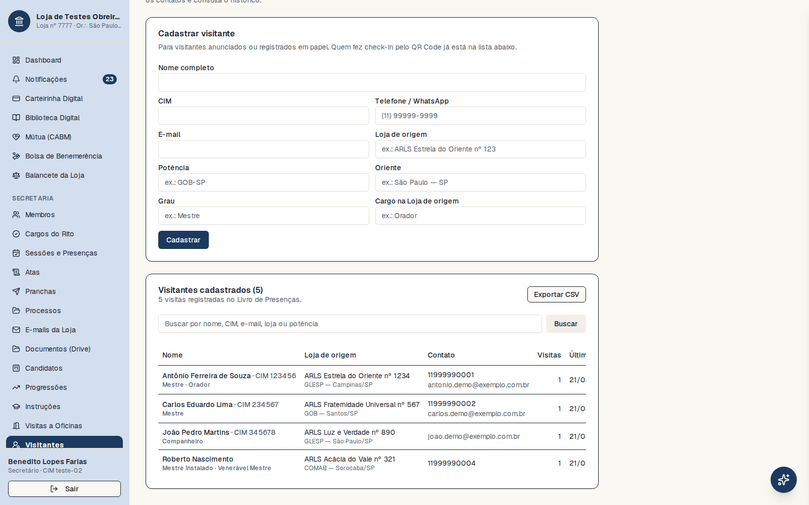

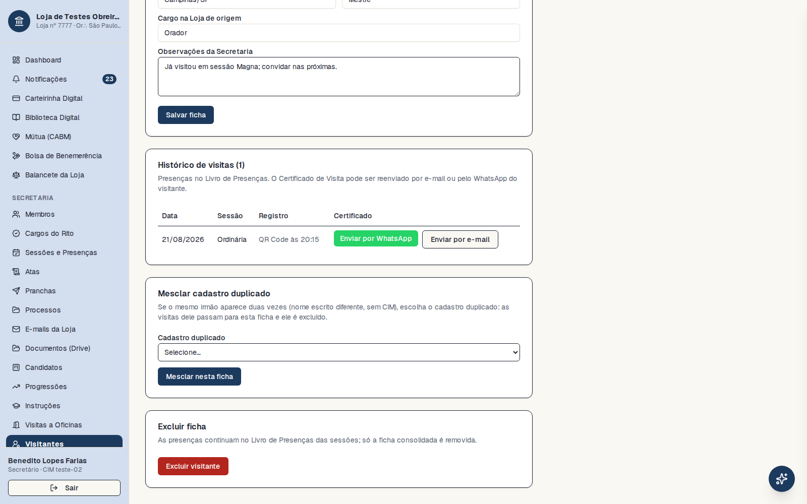

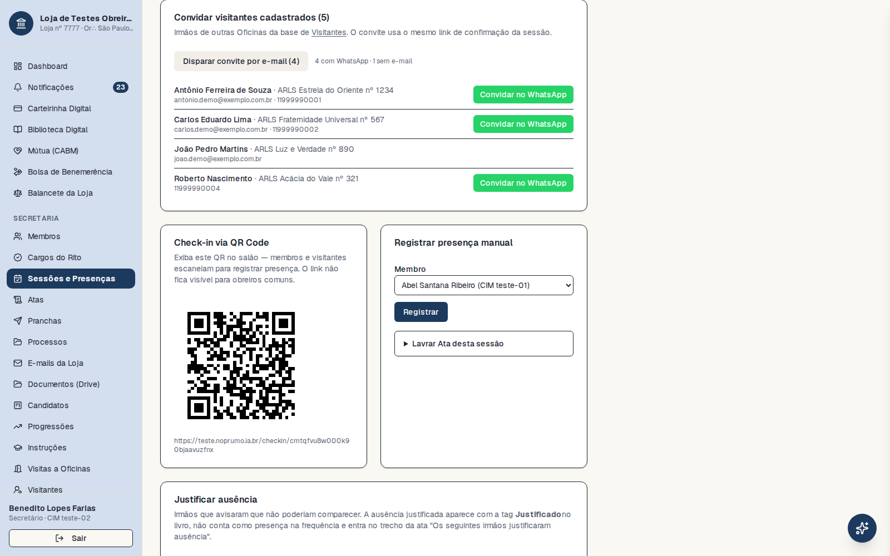

- **Duração:** ~45 s.
- **Na tela:** menu Visitantes (só Secretário e VM) → lista com busca e contagem de visitas → ficha de um visitante (dados vindos do check-in, telefone, grau, cargo, observações) → histórico de visitas com "Enviar por WhatsApp" e "Enviar por e-mail" → mesclar duplicado → Exportar CSV → página da sessão: card "Convidar visitantes cadastrados" (e-mail em massa + WhatsApp por visitante). Mostrar rapidamente o check-in pelo QR com o campo Telefone/WhatsApp.
- **Narração:**

> Todo irmão de outra Oficina que faz o check-in pelo QR Code entra automaticamente na base de Visitantes: nome, CIM, e-mail, telefone, Loja e Potência de origem. Se ele voltar, a nova visita cai na mesma ficha — o sistema reconhece pelo CIM, pelo e-mail ou pelo nome com a Loja de origem. A Secretaria completa o que faltar, mescla fichas duplicadas e exporta a lista. Na página da sessão, um clique convida por e-mail todos os visitantes cadastrados — e o WhatsApp de cada um abre com o convite pronto. E o Certificado de Visita, que já vai por e-mail no check-in, pode ser reenviado pela ficha — por e-mail ou direto no WhatsApp do visitante, com um link seguro para o PDF. Só o Secretário e o Venerável Mestre veem esta base.

## 2.12 — Atestado de Regularidade (assinatura do Secretário) (`secretario-atestado.mp4`)

- **Duração:** ~50 s.
- **Na tela:** notificação "aguarda assinatura do Secretário" → clique leva à seção Processos → card "Atestados de Regularidade" com o atestado na sua vez (Tesoureiro ✓, Secretário pendente) → "Assinar com gov.br" (conta) OU bloco "portal assinador.iti.br" (baixar PDF já com a assinatura do Tesoureiro, assinar no portal, subir) → segue ao VM. Mostrar rapidamente a página Atestado de Regularidade do Secretário: só o aviso "as assinaturas ficam em Processos".
- **Narração:**

> Quando um irmão solicita o Atestado de Regularidade, a ordem das assinaturas é: Tesoureiro, Secretário e Venerável Mestre. Assim que o Tesoureiro assina, chega a sua vez — e o sistema avisa no painel e na central de notificações. Todas as assinaturas dos cargos ficam num único lugar: a seção Processos. Lá, o atestado aparece com a assinatura do Tesoureiro já registrada e a sua pendente. Você assina com a sua conta gov.br — ou, se preferir, baixa o PDF, assina no portal oficial e sobe o arquivo. Feito isso, o atestado segue ao Venerável Mestre para a assinatura final, e o irmão acompanha tudo pela linha do tempo dele.

## 2.13 — Quitte Placets (`secretario-quitte.mp4`)

- **Duração:** ~75 s.
- **Na tela:** aviso no topo "a assinatura gov.br do Form. 122 é feita na aba Processos" → pedido chegando do irmão (com a carta) ou "Nova solicitação" em nome dele → quadro de etapas (Novo → Em análise; Aprovado e Negado não saem do arraste) → card do pedido com a linha "Nada Consta (Tesouraria) → Form. 122 (Secretaria) → Secretário → Orador → Venerável Mestre" e "Pendente com: …" → painel "Tesouraria" (situação, capitações em aberto com as vencidas em vermelho, últimas pagas) e "Reconsultar Tesouraria" → card "Formulário oficial (Form. 122)": botão "Gerar Form. 122 automaticamente" (preenche Loja, sessão de comunicação, obreiro e data) ou anexar em PDF/Word → botão "Negar" com o parecer obrigatório → (corte para Processos: Secretário → Orador → VM) → status Aprovado → "Enviar à Guarda dos Selos" → o irmão passa a Ex-membro.
- **Narração:**

> O Quitte Placet é o documento de desligamento ou transferência de um irmão — e exige rigor. O pedido nasce com o próprio irmão, que anexa a carta escrita a próprio punho; a Secretaria também pode abrir em nome dele. Daqui em diante, a página é a sua mesa de triagem. Primeira trava: o Nada Consta da Tesouraria. O painel Tesouraria mostra, no próprio card, a situação do irmão e as capitações em aberto — só as vencidas travam, e o resultado é recalculado assim que ele paga; se houver pendência, é o Tesoureiro quem confirma o Nada Consta, na seção Processos. Depois, o formulário oficial: um clique em "Gerar Form. 122 automaticamente" e ele sai preenchido com a Loja, a sessão de comunicação e os dados do obreiro — ou anexe o seu próprio. Com a carta, o Nada Consta e o formulário no lugar, o documento vai às três assinaturas do gov.br, na seção Processos: o Secretário, o Orador e, por último, o Venerável Mestre. Se a Loja negar, o parecer é obrigatório — e o irmão o lê na página dele. Aprovado, um clique o expede à Guarda dos Selos pelo e-mail da Loja, e a situação do irmão muda para ex-membro automaticamente. Ele acompanhou cada etapa pela linha do tempo, sem precisar perguntar.

## 2.14 — Configurações da Loja e Auditoria (`secretario-config.mp4`)

- **Duração:** ~60 s.
- **Na tela:** dados cadastrais, logo, cabeçalho das atas, frequência mínima, limite de inadimplência, integrações (Asaas, Drive/Gmail), template do convite → tela de Auditoria com o registro de ações.
- **Narração:**

> Nas Configurações da Loja ficam os parâmetros que moldam o sistema à sua Oficina: dados cadastrais, logotipo, o cabeçalho institucional que sai nas atas, a frequência mínima exigida para progressão, o limite de mensalidades vencidas antes de o irmão ficar irregular, e as integrações — o gateway de pagamentos, o Google Drive e o Gmail da Loja, e até o modelo do convite de sessão. E, para a transparência da gestão, a tela de Auditoria registra quem fez o quê e quando, em todas as ações sensíveis do sistema. Governança de ponta a ponta.

---

## 2.15 — Processos: a caixa de entrada de assinaturas (`secretario-processos.mp4`)

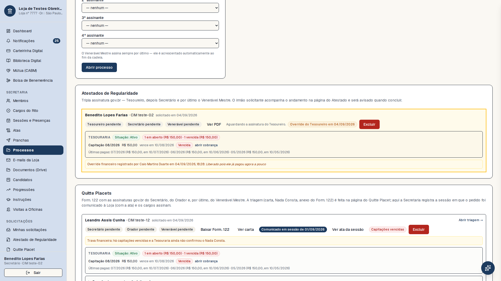

- **Objetivo:** mostrar que toda assinatura gov.br de qualquer cargo acontece num só lugar — e que cada card já traz o contexto para decidir.
- **Duração:** ~90 s.
- **Na tela:** chegar pelo aviso do sino → menu Processos abre com o card do item destacado → cards "Atestados de Regularidade" (Tesoureiro → Secretário → VM) e "Quitte Placets" (Secretário → Orador → VM) na vez do cargo, cada um com o painel "Tesouraria" (situação, capitações em aberto, últimas pagas) → atestado travado por capitação vencida, com a nota "Só o Tesoureiro registra o override" → "Documentos da Secretaria": card "Novo processo" (PDF ou Word + cadeia de assinantes em 4 caixas: Secretário, Tesoureiro, Orador, 1º Vigilante e 2º Vigilante; o VM entra sozinho no fim) → processo vindo de uma prancha (badge "vez do Secretário") → "Assinar com gov.br" / bloco portal ITI (o sistema valida o certificado e o CPF) → após a última assinatura, "Assinado por toda a cadeia" → bloco de envio com Guarda dos Selos em destaque + cópia a irmãos do quadro → "Enviado a … em …" → "Baixar documento (com assinaturas)".
- **Narração:**

> Processos é a mesa de assinaturas da Loja. Tudo o que precisa de assinatura digital do gov.br chega aqui, separado por tipo: os Atestados de Regularidade, os Quitte Placets, os pedidos de afastamento e os documentos oficiais da Secretaria — anexos de pranchas, formulários do GOB preenchidos, ofícios. Quando o aviso chega pelo sino ou pelo e-mail, o clique abre esta página já no card certo, destacado. E o card traz o que você precisa para assinar com consciência: o painel Tesouraria mostra a situação do irmão, as capitações em aberto e as últimas pagas — se houver capitação vencida, o atestado fica travado, e só o Tesoureiro pode liberá-lo, com justificativa. Cada documento traz a sua cadeia de assinantes, em ordem: ao abrir um processo, você define até quatro — Secretário, Tesoureiro, Orador, Primeiro ou Segundo Vigilante —, e o Venerável Mestre assina sempre por último. Quem está na vez recebe o e-mail na hora. Assina-se com a conta gov.br ou pelo portal oficial — e, nesse caso, o sistema confere o certificado e o CPF de quem assinou. Concluída a cadeia, o sistema pergunta para quem enviar — a Guarda dos Selos em destaque —, e, se o documento veio de uma prancha, a versão assinada volta para ela automaticamente. Um só lugar, uma só ordem, nenhuma assinatura perdida.

## 2.16 — Mútua: entregas do quadro (`secretario-mutua.mp4`)

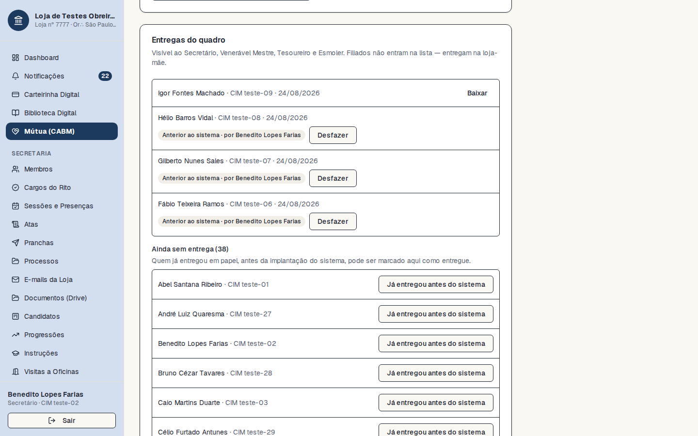

- **Objetivo:** acompanhar quem entregou a Declaração de Beneficiários e registrar as entregas antigas em papel.
- **Duração:** ~60 s.
- **Na tela:** menu Mútua (CABM) → card "Entregas do quadro": lista com data e botão Baixar em cada entrega → entregas com a etiqueta "Anterior ao sistema · por [nome]" e o botão Desfazer → lista "Ainda sem entrega" com o botão "Já entregou antes do sistema" em cada irmão → central de Notificações com o alerta "Mútua: X irmão(s) sem a Declaração de Beneficiários".
- **Narração:**

> Na seção Mútua, o Secretário, o Venerável, o Tesoureiro e o Esmoler enxergam a situação de todo o quadro: quem já entregou a Declaração de Beneficiários — com o arquivo disponível para baixar — e quem ainda não. Cada nova entrega gera um aviso na hora para os quatro cargos. E as declarações antigas, entregues em papel antes do sistema? O Secretário e o Venerável marcam o irmão com um clique no botão "Já entregou antes do sistema" — o registro guarda quem fez a marcação e pode ser desfeito enquanto não houver arquivo anexado. Os irmãos filiados ficam de fora da lista, porque entregam na loja-mãe. E ninguém cai no esquecimento: a central de notificações lembra cada irmão pendente da sua entrega e mostra à gestão, num só alerta, quantos ainda faltam. A Mútua em dia é zelo com as famílias da Loja.

# PARTE 3 — TESOUREIRO

O Tesoureiro vê os menus comuns e mais: Mensalidades, Despesas e Balancete.

## 3.1 — Dashboard do Tesoureiro (`tesoureiro-dashboard.mp4`)

- **Duração:** ~55 s.
- **Na tela:** faixa "Minha vez": atestados na vez do Tesoureiro, Nada Consta de Quitte a confirmar, despesas a aprovar, com os botões Assinar / Registrar / Aprovar → sino → receitas, despesas e saldo do mês → inadimplência → mensalidades vencidas → despesas aguardando aprovação → (mock) o e-mail "resumo diário da Tesouraria" e o aviso de pagamento com valor divergente.
- **Narração:**

> O painel do Tesoureiro começa pela sua vez: os Atestados de Regularidade que aguardam a sua assinatura, os Quitte Placets em que a Tesouraria precisa confirmar o Nada Consta e as despesas que dependem da sua aprovação — cada um com o botão da ação e há quantos dias espera. Depois, a saúde financeira da Loja em números claros: receitas, despesas e saldo do mês, e o total da inadimplência, com a lista das mensalidades vencidas. Os avisos chegam também por e-mail, na hora em que é a sua vez, e um resumo diário reúne os pagamentos do dia — inclusive quando o valor pago não bate com a cobrança. Tudo o que depende de você, em uma só tela.

## 3.2 — Mensalidades (capitações) (`tesoureiro-mensalidades.mp4`)

- **Duração:** ~75 s.
- **Na tela:** gerar cobranças do mês → link de pagamento (cartão, boleto, Pix via Asaas) → baixa manual → status vencidas → irmão irregular automático ao passar o limite.
- **Narração:**

> As capitações — as mensalidades dos irmãos — ganham aqui um fluxo profissional. Com um clique, você gera as cobranças do mês para todo o quadro. Cada irmão recebe o link de pagamento e escolhe como pagar: cartão, boleto ou Pix, pela integração com o gateway de pagamentos. Pagou por fora? Dê a baixa manual. O sistema acompanha os vencimentos e aplica a regra da Loja automaticamente: ao acumular mensalidades vencidas além do limite configurado, o irmão passa à situação irregular — e volta ao normal quando quita. Menos cobrança constrangedora, mais tesouraria em dia.

## 3.3 — Despesas com dupla aprovação (`tesoureiro-despesas.mp4`)

- **Duração:** ~50 s.
- **Na tela:** lançar despesa → status pendente de aprovação → aprovação do Tesoureiro E do VM → pagamento → entrada automática no livro-caixa.
- **Narração:**

> Nenhuma despesa da Loja é paga por decisão de uma só pessoa. Ao lançar uma despesa, ela nasce pendente — e precisa de duas aprovações: a do Tesoureiro e a do Venerável Mestre. É a trava de governança que protege o patrimônio da Oficina e quem a administra. Aprovada e paga, a despesa entra automaticamente no livro-caixa do balancete, na categoria certa. Controle a quatro mãos, prestação de contas sem surpresas.

## 3.4 — Balancete (`tesoureiro-balancete.mp4`)

- **Duração:** ~60 s.
- **Na tela:** livro-caixa do mês → card "Fechamento do mês" com badge "Aberto" → receitas por categoria (capitações, tronco, eventos) → despesas → lançar receita manual → exportar CSV → voltar ao mês anterior (já terminado) → "Fechar mês" com observação opcional → badge "Fechado · aguardando ciência" e carimbo "Fechado por X em data" → tentar lançar receita com data dentro do mês fechado: erro "Mês fechado — reabra na Tesouraria" → mostrar "Reabrir mês" (motivo obrigatório) sem executar → na faixa "Minha vez", o item "Balancete de MM/AAAA ainda aberto" (aparece depois do dia 10).
- **Narração:**

> O Balancete é o livro-caixa da Loja, mês a mês: de um lado, as receitas — capitações, tronco de beneficência, eventos e doações; do outro, as despesas pagas, com totais por categoria. Entradas avulsas você registra em "Lançar receita". E, na hora da prestação de contas, exporte tudo em CSV. Terminou o mês? Clique em "Fechar mês": os totais ficam congelados, o Conselho de Contas é avisado para registrar a ciência e o quadro passa a ver o mês no Balancete da Loja. A partir daí, nenhum lançamento manual entra naquele mês — se precisar corrigir algo, use "Reabrir mês", informe o motivo e feche de novo. Pagamentos automáticos que chegarem depois entram na data de hoje, e você é avisado. Depois do dia dez, o mês anterior ainda aberto aparece na sua "Minha vez". Transparência que se demonstra em números — e se fecha com assinatura.

## 3.5 — Atestado de Regularidade e Nada Consta (assinatura do Tesoureiro) (`tesoureiro-atestado.mp4`)

- **Duração:** ~70 s.
- **Na tela:** e-mail/sino "aguarda assinatura do Tesoureiro" → clique abre Processos com o card destacado → painel "Tesouraria" no card: situação, capitações em aberto (vencidas em vermelho), últimas pagas → caso regular: "Assinar com gov.br" OU bloco portal assinador.iti.br → badge Tesoureiro ✓, segue ao Secretário → caso com capitação vencida: card travado, formulário "Registrar override financeiro (liberar assinaturas)" com a justificativa (fica na auditoria e visível no card) → card "Quitte Placets": badge "Capitações vencidas" e botão "Confirmar Nada Consta" (confirmação com aviso ao Secretário).
- **Narração:**

> Quando um irmão solicita o Atestado de Regularidade, você é o primeiro da fila — afinal, é o Tesoureiro quem atesta que o irmão está em dia com os metais. O aviso chega no painel, no sino e no e-mail, e o clique abre a seção Processos já no card do irmão. Ali, o painel Tesouraria mostra o que você precisa: a situação dele, as capitações em aberto e as últimas pagas. Se estiver tudo em dia, assine com a sua conta gov.br ou pelo portal oficial, e o atestado segue ao Secretário e, por fim, ao Venerável Mestre. Se houver capitação vencida, o sistema trava as assinaturas — e só o Tesoureiro pode liberar, registrando uma justificativa que fica na auditoria e à vista de todos no card. O mesmo cuidado vale para o Quitte Placet: o Nada Consta considera apenas as capitações vencidas, é recalculado quando o irmão paga, e, se ainda houver pendência, é você quem decide com o botão "Confirmar Nada Consta". O irmão vê, na linha do tempo dele, que a etapa do Tesoureiro foi cumprida — e recebe o aviso na hora.

---

# PARTE 4 — VENERÁVEL MESTRE

O VM tem visão total: menus da Secretaria, da Tesouraria e da gestão da Loja.

## 4.1 — Dashboard do Venerável: "Minha vez" e Fila da Loja (`veneravel-dashboard.mp4`)

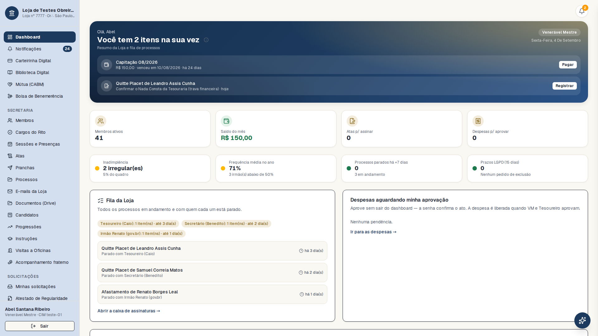

- **Duração:** ~80 s.
- **Na tela:** faixa "Minha vez" ("Resumo da Loja e fila de processos"): assinaturas e aprovações na vez do VM → cartões: membros ativos, saldo do mês, atas para assinar, despesas para aprovar → semáforos: Inadimplência (irregulares e % do quadro), Frequência média no ano (irmãos abaixo do mínimo), Processos parados há +7 dias, Prazos LGPD (15 dias) → card "Fila da Loja": etiquetas de gargalo por cargo ("Tesoureiro (nome): 1 item · até 3 dias") e a lista "Parado com …" com "há N dia(s)" → "Abrir a caixa de assinaturas" → card "Despesas aguardando minha aprovação": botão "Aprovar agora" → diálogo com senha → "Aprovar despesa" → alerta vermelho de comunicações em atraso → cards de atas na minha vez (assinar inline).
- **Narração:**

> O painel do Venerável Mestre é o posto de comando da Loja. No topo, a sua vez: as assinaturas e aprovações que só o Venerável faz, cada uma com o botão da ação. Nos cartões, os números essenciais: membros ativos, saldo do mês, atas aguardando a sua assinatura e despesas aguardando a sua aprovação. Abaixo, quatro semáforos dizem como a Loja está: a inadimplência, a frequência média do ano, os processos parados há mais de sete dias e os prazos da Lei de Proteção de Dados. E a Fila da Loja mostra o que ninguém mais vê inteiro: todos os processos em andamento, com quem cada um está parado e há quantos dias — com o gargalo por cargo em destaque. É a visão para cobrar sem microgerenciar. As despesas se aprovam dali mesmo: um clique, a senha, e a dupla aprovação está registrada. Se algum prazo regulamentar estourar, um alerta vermelho salta à vista. Malhete na mão, decisões na tela.

## 4.2 — Assinaturas do Venerável (`veneravel-assinaturas.mp4`)

- **Duração:** ~75 s.
- **Na tela:** atas: assinar inline (senha) ou gov.br → e-mail/sino "aguarda assinatura do Venerável Mestre" → menu Processos abre no card destacado → cards Atestados (VM último: Tesoureiro ✓, Secretário ✓; painel Tesouraria à vista; "Assinar com gov.br"), Quitte Placets (Secretário ✓ → Orador ✓ → VM; Nada Consta confirmado) e Documentos da Secretaria (prancha na vez do VM) → após assinar, bloco de envio à Guarda dos Selos → (Quitte) ao enviar, o irmão vira Ex-membro; (afastamento) o irmão vira Licenciado com data de retorno.
- **Narração:**

> Boa parte do dia a dia do Venerável são as assinaturas — e o sistema as organiza todas. Nas atas, o Venerável assina primeiro, e o Secretário sela em seguida. Todo o resto está numa única seção: Processos — e o aviso, no sino ou no e-mail, leva direto ao card da vez. Nos Atestados de Regularidade, a sua é a assinatura final, depois do Tesoureiro e do Secretário; o painel Tesouraria mostra no próprio card que o irmão está em dia. Nos Quitte Placets, você sela depois do Secretário e do Orador, sempre após o Nada Consta da Tesouraria — e, ao expedir à Guarda dos Selos, a situação do irmão muda automaticamente. No pedido de afastamento, a sua assinatura fecha o Formulário 116 e o irmão passa a licenciado, com a data prevista de retorno. E nas pranchas e formulários oficiais, o Venerável assina sempre por último, fechando a cadeia — e é aí que o sistema oferece o envio à Guarda dos Selos. Tudo com a assinatura digital do gov.br, direto pela sua conta ou pelo portal oficial. A autoridade do cargo, com a praticidade da tecnologia.

## 4.3 — Governança e travas do sistema (`veneravel-governanca.mp4`)

- **Duração:** ~60 s.
- **Na tela:** despesa exigindo VM + Tesoureiro → Quitte Placet travado sem Nada Consta → progressão travada sem frequência/instruções → auditoria.
- **Narração:**

> O NoPrumo foi desenhado para que as regras da Ordem se cumpram por construção. Nenhuma despesa é paga sem as duas aprovações — a sua e a do Tesoureiro. Nenhum Quitte Placet é emitido sem o Nada Consta da Tesouraria. Nenhuma progressão avança sem interstício, instruções e frequência em dia. E cada ação sensível fica registrada na auditoria: quem fez, o quê e quando. Para o Venerável, isso significa tranquilidade: a Loja funciona conforme o rito e o regulamento, e o sistema é testemunha de tudo.

## 4.4 — Visão financeira do Venerável (`veneravel-financeiro.mp4`)

- **Duração:** ~45 s.
- **Na tela:** semáforo de inadimplência no dashboard → menus da Tesouraria em modo VM: mensalidades, despesas (aprovar — também pelo card do dashboard com senha), balancete → menu "Acompanhamento fraterno" (o VM vê a mesma página do Esmoler).
- **Narração:**

> O Venerável acompanha as finanças lado a lado com o Tesoureiro: o semáforo de inadimplência já no painel, as mensalidades e os irmãos em atraso, as despesas — que dependem também da sua aprovação, e podem ser aprovadas dali mesmo, com a senha — e o balancete completo, mês a mês. E, porque número é gente, o Venerável tem acesso ao Acompanhamento fraterno do Esmoler: quem está perto do limite, quem anda faltando, quem está licenciado. Nada acontece no caixa da Loja fora do seu campo de visão.

## 4.5 — Configurações e auditoria (visão do VM) (`veneravel-config.mp4`)

- **Duração:** ~40 s.
- **Na tela:** Configurações da Loja → parâmetros de governança (frequência mínima, limite de inadimplência) → Auditoria.
- **Narração:**

> É nas Configurações da Loja que o Venerável e o Secretário definem as regras do jogo: a frequência mínima para progressão, o limite de inadimplência, as integrações e a identidade visual dos documentos. E na Auditoria, o registro fiel de todas as ações da gestão. Parâmetros claros, história registrada.

---

## 4.6 — Chave Pix da Benemerência (`veneravel-benemerencia.mp4`)

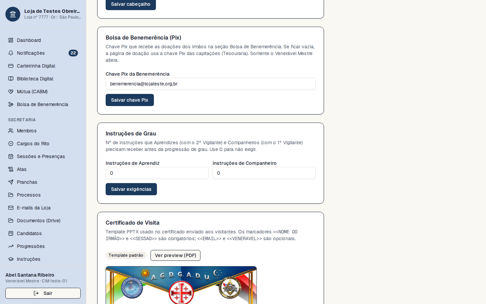

- **Objetivo:** o Venerável cadastra a chave Pix que recebe as doações da Bolsa de Benemerência.
- **Duração:** ~35 s.
- **Na tela:** menu Configurações da Loja → card "Bolsa de Benemerência (Pix)" → digitar a chave (CNPJ, e-mail, telefone ou chave aleatória) → "Salvar chave Pix" → abrir a seção Bolsa de Benemerência e mostrar o QR Code gerado com a nova chave.
- **Narração:**

> As doações da Bolsa de Benemerência caem direto na conta da Loja — e quem define o destino é o Venerável Mestre. Nas Configurações da Loja, o card Bolsa de Benemerência recebe a chave Pix: pode ser o CNPJ, um e-mail, um telefone ou uma chave aleatória. Salvou, pronto: a página de doação de todos os irmãos passa a gerar o QR Code e o Copia e Cola com essa chave, na hora. Se o campo ficar vazio, o sistema usa a chave Pix das capitações, cadastrada pela Tesouraria — e só o Venerável altera a da Benemerência, com registro na auditoria.

## 4.7 — Rifa de Benemerência (visão do VM) (`veneravel-rifa.mp4`)

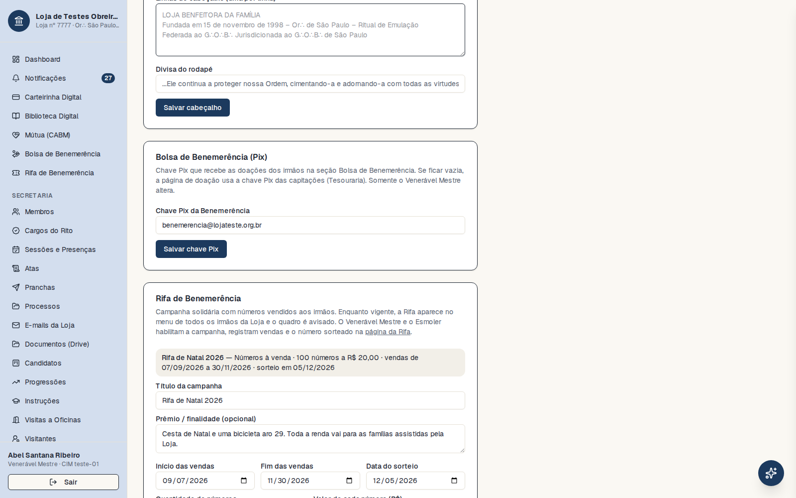

- **Objetivo:** o Venerável habilita a campanha da Rifa nas Configurações da Loja (o Esmoler faz o mesmo pela página da Rifa).
- **Duração:** ~40 s.
- **Na tela:** Configurações da Loja → card "Rifa de Benemerência" logo abaixo da chave Pix → status da campanha ativa ("Rifa de Natal 2026 — Números à venda · 100 números a R$ 20,00 · vendas … · sorteio …") → formulário: título, prêmio com fotos, início e fim das vendas, data do sorteio, quantidade e valor → "Habilitar campanha" / "Salvar alterações" → link "página da Rifa" para a gestão dos números e o sorteio → "Encerrar campanha".
- **Narração:**

> A Rifa de Benemerência nasce nas Configurações da Loja, ao lado da chave Pix que recebe as doações. O Venerável define o título, o prêmio com fotos, o período de vendas, a quantidade de números, o valor de cada um e a data do sorteio — e, ao habilitar, a Rifa entra no menu de todos os irmãos, que são avisados na hora. O Esmoler tem o mesmo formulário na página da Rifa, onde ficam também a gestão dos números e o sorteio. Uma campanha ativa por vez; encerrada, vai para o histórico.

# PARTE 5 — CONSELHO DE CONTAS

## 5.1 — Painel e fiscalização (`conselho-fiscalizacao.mp4`)

- **Duração:** ~60 s.
- **Na tela:** faixa "Minha vez" do conselheiro (normalmente "Nada pendente com você" — o Conselho não assina) → dashboard somente leitura: resultado do ano, despesas recentes, inadimplência → navegar por mensalidades, despesas, balancete → Processos: painel Tesouraria dos cards apenas para conferência → exportar CSV → tudo sem botões de edição → (mock) o e-mail de resumo (digest) que o Conselho recebe.
- **Narração:**

> Ao Conselho de Contas cabe fiscalizar — e o sistema dá ao Conselho exatamente o que ele precisa: acesso completo, em modo somente leitura. A faixa do topo costuma dizer "nada pendente": o conselheiro não assina nem aprova; ele confere. O painel mostra o resultado financeiro do ano, as despesas recentes e a inadimplência. Dali, o conselheiro navega pelas mensalidades, pelas despesas — verificando as duplas aprovações — e pelo balancete de cada mês, com exportação em CSV para o parecer. Na seção Processos, ele vê o painel Tesouraria de cada atestado e Quitte Placet, sem poder assinar. E os avisos chegam num resumo periódico por e-mail, sem a urgência de quem tem a vez. Ver tudo, sem poder alterar nada: é a independência que a fiscalização exige.

## 5.2 — Ciência do balancete (`conselho-ciencia-balancete.mp4`)

- **Objetivo:** mostrar o único registro que o Conselho faz no sistema: a ciência do balancete mensal fechado pela Tesouraria.
- **Duração:** ~45 s.
- **Na tela:** sino/"Minha vez" do conselheiro com o item "Balancete de MM/AAAA fechado — aguardando a ciência do Conselho de Contas" → clicar leva ao Balancete da Tesouraria do mês, card "Fechamento do mês" com badge "Fechado · aguardando ciência" e carimbo "Fechado por X em data" → conferir consolidado por categoria e lançamentos (se houver, o aviso "há lançamentos posteriores ao fechamento") → botão "Registrar ciência do balancete MM/AAAA" → badge muda para "Fechado · ciência registrada" e o carimbo ganha "Ciência do Conselho por Y em data" → o Tesoureiro e o Venerável recebem o aviso → abrir o Balancete da Loja (/balancete) e mostrar o mesmo carimbo visível a todo o quadro. No assistente, o chip "Há balancete fechado aguardando minha ciência?".
- **Narração:**

> O Conselho não lança nem assina — mas há um registro que só ele faz. Quando o Tesoureiro fecha o mês, o conselheiro recebe o aviso: "Balancete fechado — registre a ciência". Ele abre o balancete daquele mês, confere os totais congelados, o consolidado por categoria e cada lançamento. Se algo entrou depois do fechamento, o sistema avisa. Conferido, basta clicar em "Registrar ciência": o carimbo passa a mostrar quem fechou e quem conferiu, o Tesoureiro e o Venerável são avisados, e é esse carimbo que todo o quadro vê no Balancete da Loja. Fechar é da Tesouraria; dar ciência é do Conselho; consultar é de todos.

---

# PARTE 6 — ESMOLER (HOSPITALEIRO)

## 6.1 — Alertas de bem-estar (`esmoler-alertas.mp4`)

- **Duração:** ~50 s.
- **Na tela:** faixa "Minha vez" do Esmoler com os alertas dirigidos a ele → sino → página de Notificações: irmão próximo do limite de inadimplência → irmão com frequência baixa → irmão que passou a licenciado → clicar no aviso: abre o irmão no Acompanhamento fraterno → o e-mail correspondente.
- **Narração:**

> O Esmoler é os olhos e o coração da Loja voltados ao bem-estar dos irmãos — e o sistema trabalha ao seu lado. Quando um irmão acumula mensalidades vencidas e se aproxima do limite que o tornaria irregular, o Esmoler recebe um aviso reservado: talvez seja hora de um contato fraterno, antes que o problema cresça. O mesmo vale para a frequência: se um irmão começa a faltar além do normal, o alerta chega — porque atrás de uma ausência pode haver uma dificuldade. E, quando um irmão se afasta da Loja, o Esmoler é avisado, com a data prevista de retorno. Esses alertas aparecem na sua vez, no sino e no e-mail, e cada um abre direto o irmão na página de Acompanhamento fraterno. Tecnologia a serviço da fraternidade: é para isso que esses alertas existem.

## 6.2 — Acompanhamento fraterno (`esmoler-acompanhamento.mp4`)

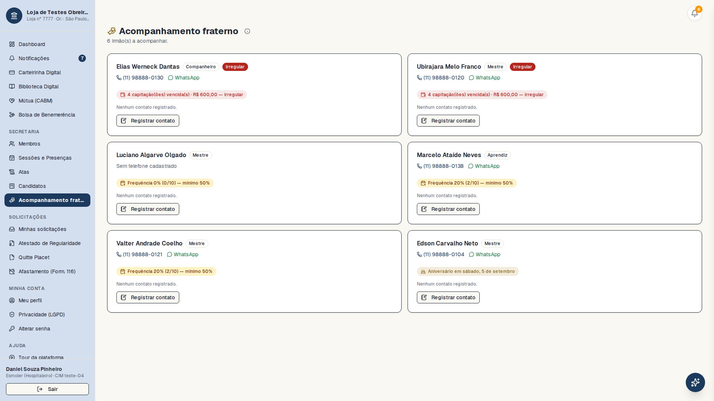

- **Objetivo:** a página de trabalho do Esmoler (e do Venerável): quem precisa de um contato esta semana, com telefone à mão e registro do que foi feito.
- **Duração:** ~60 s.
- **Na tela:** menu "Acompanhamento fraterno" → cabeçalho "N irmão(s) a acompanhar" → cards por irmão com grau e situação, telefone e link WhatsApp, e a etiqueta do motivo: "4 capitações vencidas · R$ … — irregular", "perto do limite", "Frequência 20% (2/10) — mínimo 50%", "Licenciado — retorno previsto em …", "Aniversário em …" → botão "Registrar contato": campo de nota → salvar → "Último contato: … por …" → card "Contatos recentes" com o histórico → quando não há ninguém: "Ninguém precisa de atenção especial nesta semana."
- **Narração:**

> A página de Acompanhamento fraterno é a lista de quem merece um contato nesta semana — montada pelo próprio sistema. Aparecem aqui os irmãos com capitações em atraso ou perto do limite de irregularidade, os que estão com a frequência abaixo do mínimo da Loja, os licenciados, com a data prevista de retorno, e os aniversariantes dos próximos dias. Cada card traz o motivo, o grau e o telefone, com o atalho para o WhatsApp: é ligar ou escrever. Feito o contato, registre-o: uma nota curta, e a Loja passa a saber que aquele irmão foi ouvido — pelo Esmoler ou pelo Venerável, que vê a mesma página. Os contatos recentes ficam no histórico, e o irmão que se regulariza sai da lista sozinho. Nenhum irmão esquecido: essa é a medida do zelo de uma Loja.

---

## 6.3 — Rifa de Benemerência: campanha, vendas e sorteio (`esmoler-rifa.mp4`)

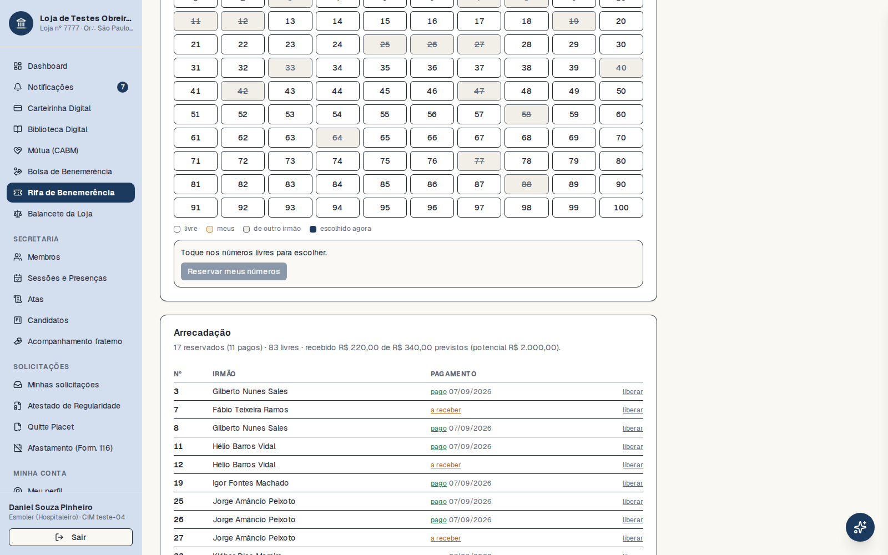

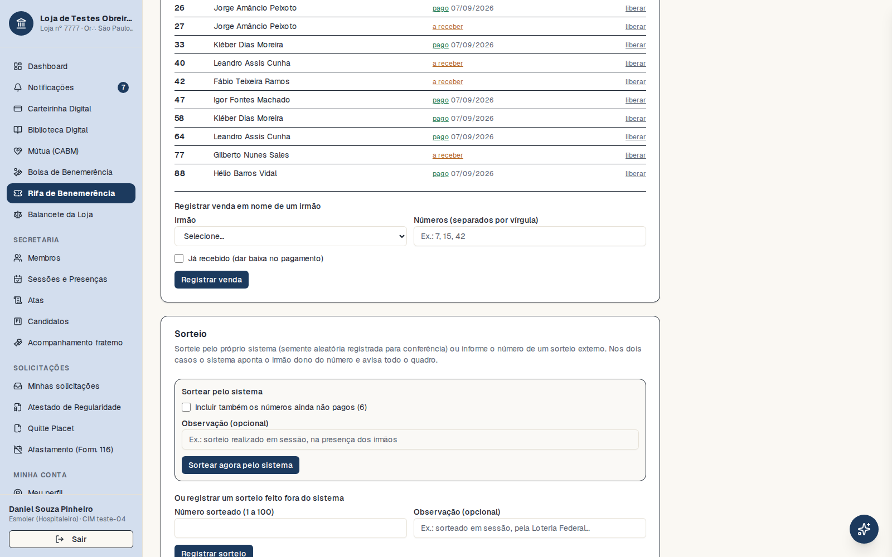

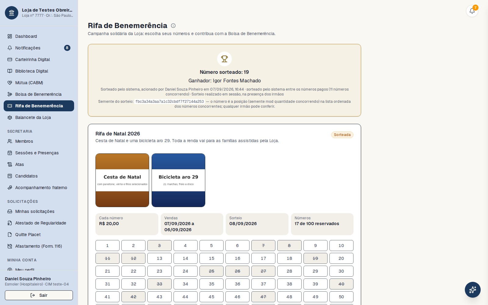

- **Objetivo:** o Esmoler conduz a campanha de ponta a ponta: habilita, acompanha a arrecadação, registra vendas e pagamentos e faz o sorteio com transparência.
- **Duração:** ~80 s.
- **Na tela:** menu "Rifa de Benemerência" → "Habilitar campanha" (título, prêmio, fotos, datas, quantidade, valor) → aviso a todo o quadro → card "Arrecadação": "17 reservados (11 pagos) · 83 livres · recebido R$ 220,00 de R$ 340,00 previstos" → tabela nº / irmão / pagamento: clicar em "a receber" → "pago" com a data → "liberar" → "Registrar venda em nome de um irmão" (números separados por vírgula, "Já recebido") → após o fim das vendas, card "Sorteio": "Sortear agora pelo sistema" com a caixa "Incluir também os números ainda não pagos" → confirmação → card dourado com número, ganhador, "Sorteado pelo sistema, acionado por … em … · entre os números pagos (11 números concorrendo)" e a semente → alternativa "registrar um sorteio feito fora do sistema" → auditoria.
- **Narração:**

> A Rifa de Benemerência é uma ferramenta do Esmoler — e do Venerável — para arrecadar com organização e transparência. Habilite a campanha: título, prêmio com fotos, período de vendas, quantidade de números, valor e data do sorteio. No mesmo instante ela aparece no menu de todos os irmãos, que recebem o aviso. Daí em diante, a página é o seu painel: quantos números foram reservados, quantos pagos, o que já entrou e o que ainda falta. Cada número traz o irmão e o pagamento; recebeu o Pix, um clique dá a baixa. Vendeu em sessão? Registre a venda em nome do irmão, já como paga. Encerradas as vendas, chega a hora do sorteio — e o próprio sistema sorteia: entre os números pagos, ou entre todos, se você marcar a opção. O resultado mostra o ganhador, quem acionou, a hora, quantos números concorriam e a semente aleatória, com a regra que qualquer irmão pode conferir. Preferiu a Loteria Federal ou o globo em sessão? Registre o número, e o sistema aponta o irmão. Tudo fica na auditoria, e o quadro inteiro recebe o resultado.

# PARTE 7 — VIGILANTES (INSTRUTORES)

## 7.1 — Instruções de grau (`vigilantes-instrucoes.mp4`)

- **Duração:** ~45 s.
- **Na tela:** menu Instruções (aparece para quem tem cargo de Vigilante) → registrar instrução dada → meta configurada pela Loja → progresso de cada irmão → trava na progressão.
- **Narração:**

> Aos Vigilantes cabe instruir: o Segundo Vigilante forma os Aprendizes; o Primeiro, os Companheiros. No menu Instruções, o Vigilante registra cada instrução ministrada e acompanha o progresso de cada irmão rumo à meta definida pela Loja. Esses registros não são apenas memória: são requisito — sem as instruções em dia, o processo de progressão de grau não avança. Ensinar, registrar, e ver o irmão pronto para subir mais um degrau.

---

## 7.2 — Assinaturas do Orador e dos Vigilantes nos Processos (`vigilantes-processos.mp4`)

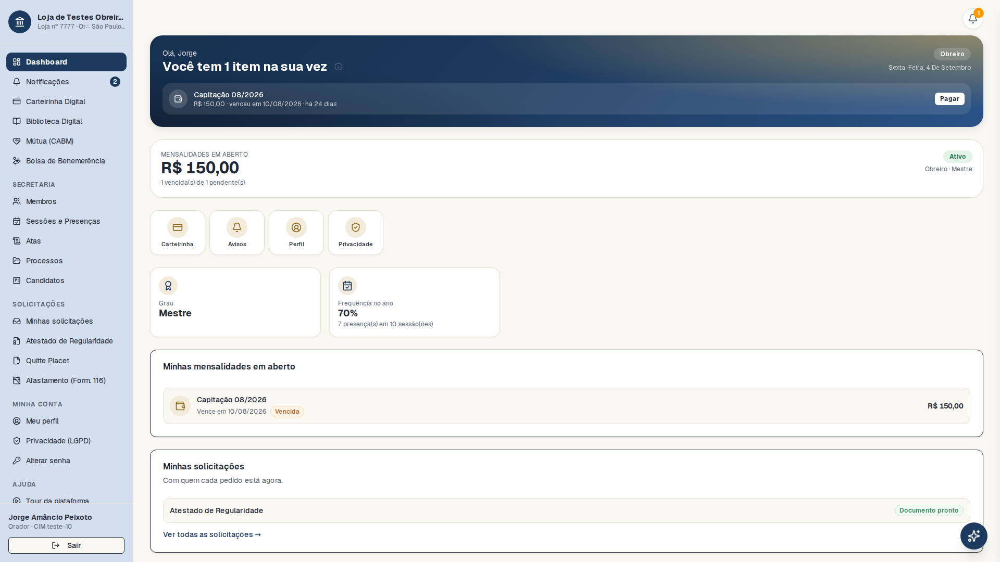

- **Objetivo:** mostrar que o Orador, o 1º e o 2º Vigilante também assinam, com o gov.br, os documentos em que estão na cadeia — e que o Orador é assinante fixo do Quitte Placet.
- **Duração:** ~55 s.
- **Na tela:** dashboard do Obreiro com cargo de Orador/Vigilante → faixa "Minha vez" com o item "… aguarda a assinatura do Orador" e o botão Assinar → o e-mail imediato recebido na hora em que chega a vez → menu Processos (aparece para quem tem o cargo do rito) abre com o card destacado → Quitte Placet na vez do Orador (Secretário ✓ → Orador → VM) e documento da Secretaria com a cadeia (1º Secretário ✓, 2º Orador …, 3º Venerável Mestre) → "Assinar com gov.br" OU bloco portal assinador.iti.br (baixar PDF, assinar, subir) → badge "vez do Venerável Mestre". Se o cargo estiver vago, mostrar o aviso à Secretaria.
- **Narração:**

> Alguns documentos da Loja pedem também a assinatura do Orador ou dos Vigilantes — e o sistema os inclui na cadeia com a mesma assinatura digital do gov.br. O Orador, em especial, assina todo Quitte Placet, entre o Secretário e o Venerável Mestre; os Vigilantes entram quando a Secretaria os coloca na ordem de um processo. Quando chega a sua vez, o item aparece na faixa "Minha vez" do seu painel, no sino e no seu e-mail — na hora, não no fim do dia. O menu Processos aparece para você e abre direto no documento, com a ordem de assinaturas à vista. Assine com a sua conta gov.br ou pelo portal oficial, e o documento segue para o próximo da fila — até o Venerável Mestre, que assina sempre por último. O cargo do rito, com a validade jurídica do gov.br.

---

# PARTE 8 — ADMINISTRADOR DA PLATAFORMA (opcional)

## 8.1 — Administração do SaaS (`admin-plataforma.mp4`)

- **Duração:** ~40 s. (Vídeo interno/comercial — não faz parte do tour das Lojas. Sem print: a tela exige conta de super admin.)
- **Na tela:** painel /admin → criar Loja → licença e cobrança → backup automático no Drive.
- **Narração:**

> Para quem administra a plataforma, o painel de Administração concentra a gestão das Lojas: criação de novas Oficinas, licenças e cobranças, e o backup automático de todas as bases no Google Drive. Cada Loja é um ambiente isolado, com seus dados, suas integrações e seus usuários — a segurança de um sistema profissional, com a simplicidade de um clique.

---

## Checklist de produção

Legenda: **REGRAVAR** = vídeo já existente cuja tela mudou nos lotes de 04/09/2026 (staging a252396) 06/09/2026 (Visitantes, staging b681ee1) e 07/09/2026 (Rifa de Benemerência, staging 91f11c9); **NOVO** = vídeo acrescentado nestas revisões. Os demais seguem válidos.

| # | Arquivo | Cargo | Status | Observação |
|---|---------|-------|--------|------------|
| 1.1 | obreiro-login.mp4 | Obreiro | ☐ | |
| 1.2 | obreiro-dashboard.mp4 | Obreiro | ☐ | REGRAVAR — faixa "Minha vez", sino no cabeçalho, card "Minhas solicitações" (Pendente com), frequência por grau |
| 1.3 | obreiro-notificacoes.mp4 | Obreiro | ☐ | REGRAVAR — sino no desktop, aviso abre o item exato e marca lido, avisos de evento por e-mail |
| 1.4 | obreiro-carteirinha.mp4 | Obreiro | ☐ | |
| 1.5 | obreiro-biblioteca.mp4 | Obreiro | ☐ | |
| 1.6 | obreiro-sessoes.mp4 | Obreiro | ☐ | |
| 1.7 | obreiro-atas.mp4 | Obreiro | ☐ | |
| 1.8 | obreiro-candidatos.mp4 | Obreiro | ☐ | |
| 1.9 | obreiro-atestado.mp4 | Obreiro | ☐ | REGRAVAR — trava por capitação vencida, aviso a cada assinatura, PDF por e-mail |
| 1.10 | obreiro-conta.mp4 | Obreiro | ☐ | |
| 1.11 | obreiro-quitte.mp4 | Obreiro | ☐ | REGRAVAR — três assinaturas (Orador), Nada Consta só vencidas, parecer da negativa, Ex-membro automático |
| 1.12 | obreiro-mutua.mp4 | Obreiro | ☐ | |
| 1.13 | obreiro-benemerencia.mp4 | Obreiro | ☐ | |
| 1.14 | obreiro-assistente.mp4 | Obreiro | ☐ | NOVO — chips dinâmicos, "o que está na minha vez?" com links, situação financeira (Secretário) |
| 1.15 | obreiro-balancete.mp4 | Obreiro | ☐ | NOVO — balancete só leitura para todo o quadro: capitações só como total, beneficência só por categoria, sem nomes |
| 1.16 | obreiro-rifa.mp4 | Obreiro | ☐ | NOVO — Rifa de Benemerência: grade de números, QR Pix no valor, baixa do Esmoler, resultado com semente |
| 2.1 | secretario-dashboard.mp4 | Secretário | ☐ | REGRAVAR — faixa "Minha vez" com assinaturas e registros da Secretaria |
| 2.2 | secretario-membros.mp4 | Secretário | ☐ | |
| 2.3 | secretario-cargos.mp4 | Secretário | ☐ | |
| 2.4 | secretario-sessoes.mp4 | Secretário | ☐ | REGRAVAR — card "Convidar visitantes cadastrados" (e-mail em massa + WhatsApp individual), telefone no check-in QR e no RSVP do convite |
| 2.5 | secretario-atas.mp4 | Secretário | ☐ | |
| 2.6 | secretario-pranchas.mp4 | Secretário | ☐ | |
| 2.7 | secretario-emails.mp4 | Secretário | ☐ | |
| 2.8 | secretario-documentos.mp4 | Secretário | ☐ | |
| 2.9 | secretario-admissoes.mp4 | Secretário | ☐ | |
| 2.10 | secretario-progressoes.mp4 | Secretário | ☐ | |
| 2.11 | secretario-visitas.mp4 | Secretário | ☐ | |
| 2.11b | secretario-visitantes.mp4 | Secretário / Venerável | ☐ | NOVO — base de Visitantes (check-in QR alimenta a ficha), Certificado de Visita por WhatsApp, mesclar duplicados, CSV e convite aos visitantes na sessão |
| 2.12 | secretario-atestado.mp4 | Secretário | ☐ | |
| 2.13 | secretario-quitte.mp4 | Secretário | ☐ | REGRAVAR — painel Tesouraria, Nada Consta real, "Gerar Form. 122 automaticamente", Orador na cadeia, Negar com parecer |
| 2.14 | secretario-config.mp4 | Secretário | ☐ | |
| 2.15 | secretario-processos.mp4 | Secretário | ☐ | REGRAVAR — card destacado via sino, painel Tesouraria, trava/override, validação do PDF do portal ITI |
| 2.16 | secretario-mutua.mp4 | Secretário | ☐ | |
| 3.1 | tesoureiro-dashboard.mp4 | Tesoureiro | ☐ | REGRAVAR — faixa "Minha vez" (atestados, Nada Consta, despesas), resumo diário por e-mail |
| 3.2 | tesoureiro-mensalidades.mp4 | Tesoureiro | ☐ | |
| 3.3 | tesoureiro-despesas.mp4 | Tesoureiro | ☐ | |
| 3.4 | tesoureiro-balancete.mp4 | Tesoureiro | ☐ | |
| 3.5 | tesoureiro-atestado.mp4 | Tesoureiro | ☐ | REGRAVAR — painel Tesouraria, override justificado, "Confirmar Nada Consta" |
| 4.1 | veneravel-dashboard.mp4 | Venerável | ☐ | REGRAVAR — "Minha vez", semáforos, Fila da Loja, aprovação inline de despesas com senha |
| 4.2 | veneravel-assinaturas.mp4 | Venerável | ☐ | REGRAVAR — Orador no Quitte, painel Tesouraria, Ex-membro/Licenciado automáticos |
| 4.3 | veneravel-governanca.mp4 | Venerável | ☐ | |
| 4.4 | veneravel-financeiro.mp4 | Venerável | ☐ | REGRAVAR — semáforo de inadimplência, aprovação pelo dashboard, Acompanhamento fraterno |
| 4.5 | veneravel-config.mp4 | Venerável | ☐ | |
| 4.6 | veneravel-benemerencia.mp4 | Venerável | ☐ | |
| 4.7 | veneravel-rifa.mp4 | Venerável | ☐ | NOVO — card da Rifa nas Configurações da Loja (habilitar/editar/encerrar campanha) |
| 5.1 | conselho-fiscalizacao.mp4 | Conselho | ☐ | REGRAVAR — faixa "Minha vez", painel Tesouraria só leitura, digest por e-mail |
| 6.1 | esmoler-alertas.mp4 | Esmoler | ☐ | REGRAVAR — alertas na "Minha vez", aviso de licenciado, deep link para o Acompanhamento fraterno |
| 6.2 | esmoler-acompanhamento.mp4 | Esmoler / Venerável | ☐ | NOVO — página Acompanhamento fraterno com "Registrar contato" |
| 6.3 | esmoler-rifa.mp4 | Esmoler / Venerável | ☐ | NOVO — campanha com fotos, arrecadação, venda presencial, baixa, sorteio pelo sistema (pagos / todos) com semente, sorteio externo |
| 7.1 | vigilantes-instrucoes.mp4 | Vigilantes | ☐ | |
| 7.2 | vigilantes-processos.mp4 | Orador / Vigilantes | ☐ | REGRAVAR — "Minha vez", e-mail imediato, Orador assinante fixo do Quitte |
| 8.1 | admin-plataforma.mp4 | Admin | ☐ | |
